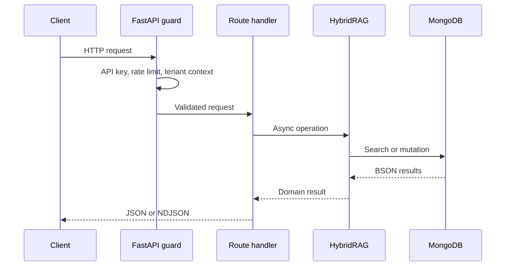

# API

HybridRAG exposes a compact reference FastAPI application and a larger engine server. The reference API in `src/hybridrag/api/main.py` is the default documented deployment path; `src/hybridrag/engine/api/rag_server.py` mounts compatibility and administration routers.

## Run the reference API

Install the API extra, configure `.env`, then start Uvicorn:

```bash
pip install -e ".[api]"
make run-api
```

The equivalent command is:

```bash
uvicorn hybridrag.api.main:app --reload --host 0.0.0.0 --port 8000
```

Once running:

- API base: `http://localhost:8000`
- Swagger UI: `http://localhost:8000/docs`
- ReDoc: `http://localhost:8000/redoc`
- OpenAPI document: `http://localhost:8000/openapi.json`
- Health: `http://localhost:8000/health`
- Readiness: `http://localhost:8000/ready`

The lifespan handler attempts to initialize `HybridRAG` at startup. If configuration or MongoDB is unavailable, the server remains available in degraded mode so health and OpenAPI documentation can still be inspected.

## Request flow



## Authentication and operational access

The reference API can require `X-API-Key` through `HYBRIDRAG_API_KEY`. If tenant isolation is configured, the same key is mapped to a tenant through `HYBRIDRAG_API_KEY_TENANTS`. The query-explain and index-diagnostic endpoints use a separate `HYBRIDRAG_OPERATOR_API_KEY`.

In-memory rate limiting is optional through `HYBRIDRAG_RATE_LIMIT_PER_WINDOW` and `HYBRIDRAG_RATE_LIMIT_WINDOW_SECONDS`. It is per-process and client-IP based, so production deployments should still apply gateway-level controls.

The engine server's `get_combined_auth_dependency()` in `src/hybridrag/engine/api/utils_api.py` supports API keys, OAuth2 bearer tokens, and route whitelists. See [Security](../security.md) before exposing either server.

## API families

| Family | Purpose |
| --- | --- |
| Reference API | Health, ingestion, queries, streaming, diagnostics, document deletion |
| Engine query API | Standard, streaming, and structured-data query responses |
| Engine document API | Upload, scan, status, deletion, reprocessing, and cache operations |
| Engine graph API | Graph labels, subgraphs, and entity/relation editing |
| Ollama compatibility API | Model discovery, generation, and chat |

The complete route catalog is in [REST endpoints](rest-endpoints.md). Request and response models for the reference API are in `src/hybridrag/api/models.py`.

## Key source files

| File | Purpose |
| --- | --- |
| `src/hybridrag/api/main.py` | Reference FastAPI app, lifecycle, guards, and routes |
| `src/hybridrag/api/models.py` | Reference request and response schemas |
| `src/hybridrag/engine/api/rag_server.py` | Full engine server and router assembly |
| `src/hybridrag/engine/api/utils_api.py` | Combined API-key and JWT authentication |
| `src/hybridrag/engine/api/routers/` | Document, query, graph, and Ollama routes |

For deployment commands and container behavior, see [Deployment](../deployment.md).
