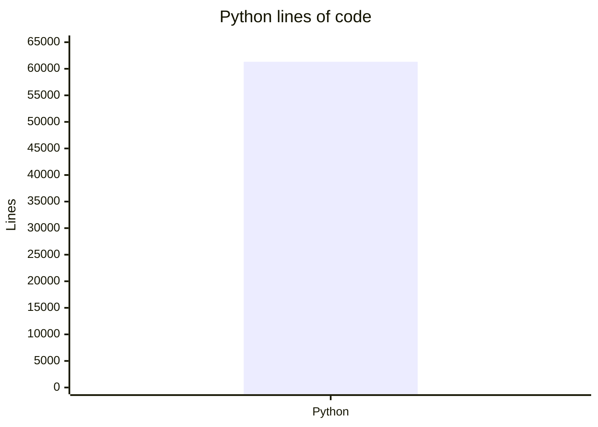
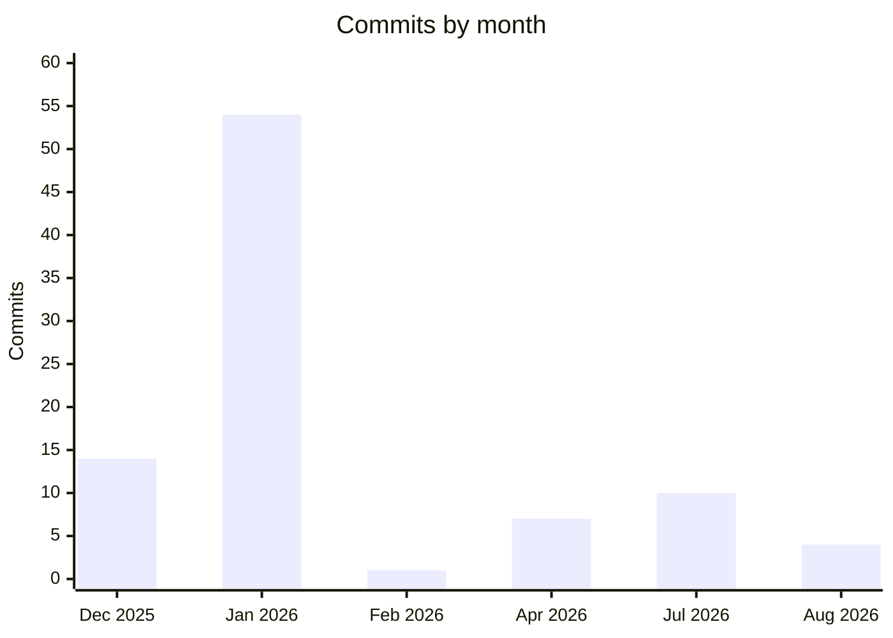

# By the numbers

Data collected on 2026-08-23 from the repository snapshot at version 0.4.0.

HybridRAG is a Python-only project with a substantial implementation and a comparatively compact test tree. The figures below are a snapshot, not a quality score.

## Snapshot

| Measure | Value |
| --- | ---: |
| Python code | 61,321 lines |
| Source files | 110 |
| Test files | 32 |
| Language | 100% Python |
| Supported Python | 3.11+ |
| Commits | 90 |
| History covered | 2025-12-15 to 2026-08-22 |
| Contributors | 1 |
| Current version | 0.4.0 |
| Tags | 1 |
| Dependencies | 59 |
| Optional-dependency groups | 9 |
| Examples | 9 |
| Notebooks | 5 |
| CI workflows | 3 |
| Source TODO/FIXME/HACK comments | 0 |

The project metadata and dependency groups are described in [Dependencies](reference/dependencies.md). The complete runtime settings are in [Configuration](reference/configuration.md).

## Size

The six largest Python files are concentrated in the engine and API implementation:

| File | Lines |
| --- | ---: |
| `src/hybridrag/engine/operate.py` | 5,246 |
| `src/hybridrag/engine/base_engine.py` | 4,118 |
| `src/hybridrag/engine/kg/mongo_impl.py` | 4,108 |
| `src/hybridrag/engine/utils.py` | 3,436 |
| `src/hybridrag/engine/api/routers/document_routes.py` | 3,255 |
| `src/hybridrag/core/rag.py` | 2,853 |

These hotspots show where most behavior is concentrated: query orchestration, storage, shared engine utilities, document APIs, and the public `HybridRAG` facade. Changes in these files deserve focused regression tests.

## Activity

| Month | Commits |
| --- | ---: |
| Dec 2025 | 14 |
| Jan 2026 | 54 |
| Feb 2026 | 1 |
| Apr 2026 | 7 |
| Jul 2026 | 10 |
| Aug 2026 | 4 |

January accounts for 60% of the recorded commits and marks the main construction sprint. Later bursts are smaller and more focused on audits, onboarding, and release hardening; see [Project lore](lore.md).

## Delivery signals

The repository has three GitHub Actions workflows: `.github/workflows/ci.yml`, `.github/workflows/publish.yml`, and `.github/workflows/test.yml`. Together they cover pull-request checks, scheduled and live tests, package validation, and PyPI publication.

The nine examples and five notebooks provide a sizeable learning surface relative to the 110 source files. The absence of TODO, FIXME, and HACK markers in source means known work is not tracked inline; contributors should use issues and ADRs rather than assuming the source contains a maintenance backlog.

## What the numbers reveal

- The engine is mature enough to have separate public API, engine API, storage, graph, and retrieval layers, but several large files remain high-risk change areas.
- The project is maintained by one contributor, so explicit tests, ADRs, and release gates carry more continuity than informal team knowledge.
- Most activity happened in short, intensive periods. The August 2026 release work focused on retrieval correctness and tenant boundaries rather than broad feature expansion.
- The test-file count is about 29% of the source-file count. File counts do not measure coverage, so use the commands in [Testing](how-to-contribute/testing.md) for change-specific validation.
