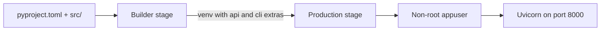

# Deployment

HybridRAG can run as a Python package, a FastAPI container, or a two-service Compose stack with the optional Chainlit UI. MongoDB remains external to the root `docker-compose.yml`; the developer-only Atlas Local stack is defined separately in `docker/docker-compose.local.yml`.

## Container image

`Dockerfile` uses a two-stage Python 3.12 slim build:



The builder installs `.[api,cli]` into `/opt/venv`. The production stage copies that environment and the application source, sets `PYTHONPATH=/app/src`, switches to an unprivileged `appuser`, and starts `hybridrag.api.main:app`.

```bash
docker build -t hybridrag:latest .
docker run --env-file .env -p 8000:8000 hybridrag:latest
```

The image health check calls `http://localhost:8000/health` every 30 seconds.

## Docker Compose

The root `docker-compose.yml` defines:

| Service | Port | Behavior |
| --- | ---: | --- |
| `api` | 8000 | Builds the production image, loads `.env`, starts the default Uvicorn command, and exposes a health check |
| `ui` | 8001 | Runs `chainlit` against `src/hybridrag/ui/chat.py`; starts only with the `ui` profile and waits for the API health check |

Both services share the `hybridrag-network` bridge network. The declared `hybridrag-data` volume is not mounted by either service in the current Compose file.

```bash
docker compose up -d
docker compose --profile ui up -d
docker compose logs -f api
docker compose down
```

## Environment

Provide configuration through `.env` or the deployment platform's secret manager. At minimum, select the MongoDB deployment and the providers used by the chosen workflow:

```dotenv
MONGODB_URI=mongodb+srv://...
MONGODB_DATABASE=hybridrag
MONGODB_WORKSPACE=production
VOYAGE_API_KEY=...
LLM_PROVIDER=anthropic
ANTHROPIC_API_KEY=...
```

For a public HTTP deployment, also review:

```dotenv
HYBRIDRAG_API_KEY=...
HYBRIDRAG_OPERATOR_API_KEY=...
CORS_ORIGINS=https://app.example.com
HYBRIDRAG_RATE_LIMIT_PER_WINDOW=60
HYBRIDRAG_RATE_LIMIT_WINDOW_SECONDS=60
```

Use a secret manager rather than baking credentials into the image. The complete typed settings are in [Configuration](reference/configuration.md); HTTP-only controls are described in [Security](security.md).

## Local MongoDB

For development and integration tests:

```bash
make mongo-up
make test-integration
make mongo-down
```

This uses `docker/docker-compose.local.yml` and exposes MongoDB Atlas Local at `mongodb://localhost:27018/?directConnection=true`.

## CI/CD

`.github/workflows/ci.yml` runs linting, Python 3.11/3.12 tests, smoke tests, main-branch integration tests, and package build validation. `.github/workflows/test.yml` adds scheduled live, cloud smoke, and benchmark jobs.

`.github/workflows/publish.yml` runs when a GitHub release is published or manually dispatched:

1. build source and wheel distributions with `python -m build`;
2. store the distributions as an Actions artifact;
3. publish to PyPI with trusted publishing and an OIDC `id-token`.

Container publication is not defined in the repository. Build and push images through your own registry pipeline, and run `make release-gate-fast` plus the applicable live gate before promotion.

## Production checks

- Keep API and operator keys separate.
- Configure exact CORS origins.
- Use MongoDB TLS and least-privilege database users.
- Apply gateway-level rate limits; the built-in limiter is process-local.
- Verify both index readiness and data synchronization after index changes.
- Treat search-index changes as explicit operator actions rather than startup side effects.

See [API](api/index.md) for readiness routes and [Testing](how-to-contribute/testing.md) for release gates.
