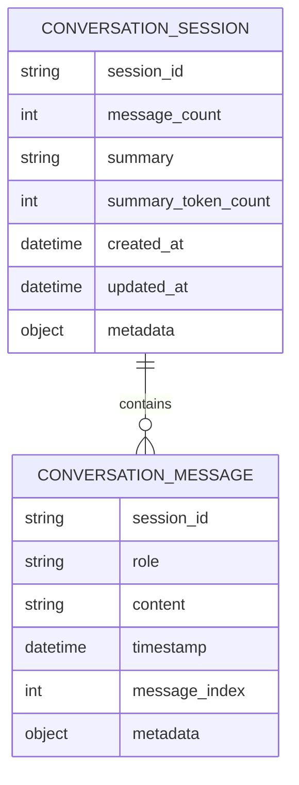
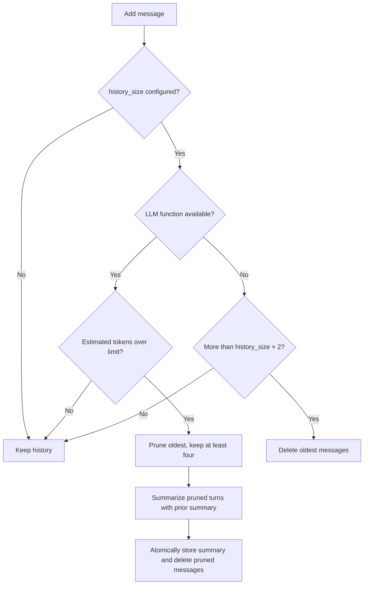

# Conversation memory

Conversation memory stores multi-turn sessions in MongoDB and supplies recent history to RAG queries. It avoids unbounded message arrays by separating session metadata from one-document-per-message storage, and it can summarize old turns when the token budget is exceeded.

## Data model

`ConversationSession` and `ConversationMemory` are implemented in `src/hybridrag/memory/conversation.py`.



The default collections are `conversation_sessions` and `conversation_messages`. Session IDs are unique. Message queries use compound indexes on `(session_id, timestamp)` and `(session_id, message_index)`. Session documents receive a 90-day TTL index on `updated_at`; initialization converts or recreates an incompatible existing index when needed.

## `ConversationSession`

The `ConversationSession` dataclass is the in-memory view of a session. It contains loaded messages, the running summary, denormalized counts, timestamps, and metadata.

- `to_history_format` returns model-ready `{role, content}` records.
- `to_context_string` puts the summary first, followed by recent messages.
- Individual message content is truncated to 500 characters in the context string.
- `max_messages` selects the newest messages without changing stored history.

## `ConversationMemory`

`ConversationMemory` owns the asynchronous persistence API:

| Method | Behavior |
| --- | --- |
| `initialize` | Creates or reuses an `AsyncMongoClient`, selects collections, and creates indexes |
| `create_session` | Inserts a session with a supplied ID or generated UUID |
| `add_message` | Inserts a user or assistant message and increments the session count |
| `get_session` | Loads session metadata and all stored messages |
| `get_history` | Returns role/content dictionaries, optionally limited to the newest messages |
| `get_context_string` | Returns summary plus recent turns for retrieval augmentation |
| `list_sessions` | Uses one aggregation and `$lookup` to include each session's last message |
| `clear_session` | Removes messages but keeps and resets the session |
| `delete_session` | Removes both session and message documents |
| `close` | Closes only a client created by the memory object |

Message insertion and session-count updates use `run_with_transaction` from `src/hybridrag/core/transaction_helper.py`, with the helper's fallback for deployments that do not support transactions. Clear and delete operations also coordinate changes across both collections.

## Self-compaction

The default limits are 50 message pairs and an estimated 32,000 tokens. Token estimation is intentionally simple: four characters count as one token.

After `add_message`, `_trim_history` selects one of two paths:



With an `llm_func`, `_compact_if_needed` removes oldest messages until the existing summary plus retained turns fit the token limit, while always keeping at least four recent messages. `SUMMARY_PROMPT` asks the LLM to progressively combine the previous summary with the newly pruned turns. The new summary, summary token estimate, remaining message count, and deletions are applied together.

If summarization fails, `_summarize_messages` returns the previous summary. If no LLM is configured, history is bounded by `history_size * 2` messages instead. Setting `history_size=None` disables the automatic post-insert trimming and compaction trigger.

## Usage

```python
from hybridrag.memory import ConversationMemory

memory = ConversationMemory(
    mongodb_uri="mongodb+srv://...",
    database="hybridrag",
    history_size=50,
    max_token_limit=32_000,
    llm_func=summarize_with_model,
)
await memory.initialize()

session_id = await memory.create_session(metadata={"channel": "cli"})
await memory.add_message(session_id, "user", "How does rank fusion work?")

context = await memory.get_context_string(session_id, max_messages=10)
# Use context when constructing the next RAG query.

await memory.add_message(session_id, "assistant", answer)
await memory.close()
```

A pre-created `AsyncMongoClient` can be injected through `client`. In that case `ConversationMemory.close` leaves ownership with the caller.

## Key source files

| File | Purpose |
| --- | --- |
| `src/hybridrag/memory/conversation.py` | Session model, MongoDB persistence, indexes, history formatting, and compaction |
| `src/hybridrag/memory/__init__.py` | Public memory exports |
| `src/hybridrag/core/transaction_helper.py` | Atomic multi-collection operations with deployment fallback |

Conversation context feeds the same request flow described in [Architecture](../overview/architecture.md).
