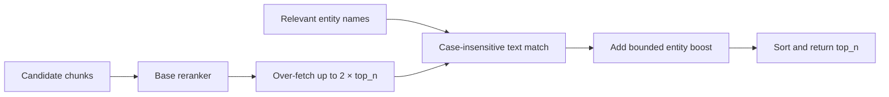

# Entity boosting

Entity boosting wraps an existing reranker and adds a structural relevance signal: how many query-relevant entity names appear in each candidate chunk. It is a post-retrieval step and does not change MongoDB search scores.

## Two-stage reranking

`EntityBoostingReranker` in `src/hybridrag/enhancements/entity_boosting.py` performs:



The base reranker receives plain chunk texts and is asked for `min(top_n * 2, len(chunks))` results. Over-fetching leaves room for entity overlap to reorder candidates that would otherwise fall just below the cutoff.

For every returned candidate, `_find_entities_in_text` performs a case-insensitive substring check against `relevant_entity_ids`. The boost is:

```text
entity_boost = boost_weight × entities_found / relevant_entities
final_score = min(1.0, relevance_score + entity_boost)
```

The default `boost_weight` is `0.2`. A chunk that contains all relevant entities can gain the full weight; a chunk with no matches gets zero. The final score is capped at 1.0.

Each boosted result keeps the original chunk data and adds:

| Field | Meaning |
| --- | --- |
| `relevance_score` | Score returned by the base reranker |
| `entity_overlap` | Number of relevant entity names found |
| `entities_found` | Matched entity names |
| `entity_boost` | Additive overlap contribution |
| `final_score` | Capped sum used for final ordering |

The matching is literal substring matching, not token-boundary matching or entity linking. Names that are substrings of unrelated words can therefore match; normalize the entity set or replace `_find_entities_in_text` if stricter semantics are required.

## Callable behavior

`EntityBoostingReranker.__call__` accepts either strings or dictionaries with `content` or `text`. String inputs are converted to chunk dictionaries.

If `relevant_entity_ids` is missing or empty, the wrapper calls the base reranker directly and returns its normal output shape. If candidates are empty, boosted reranking returns an empty list without calling the base reranker.

## Factory helper

`create_boosted_rerank_func` creates an async callable with the interface expected by HybridRAG:

```python
from hybridrag.enhancements.entity_boosting import create_boosted_rerank_func

boosted_rerank = create_boosted_rerank_func(
    base_rerank_func=voyage_rerank,
    boost_weight=0.2,
)

results = await boosted_rerank(
    query="How does Atlas Search rank change streams?",
    documents=chunks,
    top_n=10,
    relevant_entity_ids={"Atlas Search", "Change Streams"},
)
```

The helper assigns a `cache_identity` containing the wrapped reranker's identity and entity boost weight. Retrieval caches can therefore distinguish different reranking configurations.

## Choosing the entity set

The class does not discover relevant entities itself. Callers must pass names from query analysis or [Knowledge graph](knowledge-graph.md) retrieval. Keep the set focused: because the denominator is the total number of relevant entities, adding names that cannot occur in any candidate reduces every boost.

## Key source files

| File | Purpose |
| --- | --- |
| `src/hybridrag/enhancements/entity_boosting.py` | Entity-overlap scoring, two-stage reranking, and factory helper |
| `src/hybridrag/engine/operate.py` | Query retrieval and reranking orchestration |

Entity boosting normally follows candidate generation by [Hybrid search](hybrid-search.md).
