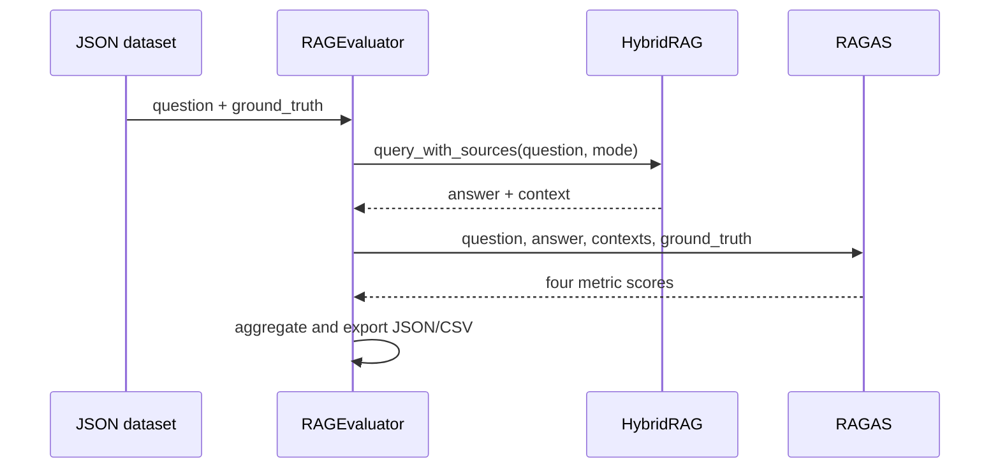

# Evaluation

HybridRAG includes an optional RAGAS runner that measures generated answers and retrieved contexts against a JSON test set. `RAGEvaluator` can use an existing `HybridRAG` instance or create one from environment-backed settings.

## Metrics

`src/hybridrag/evaluation/ragas_eval.py` evaluates each case with four RAGAS metrics:

| Metric | Question answered |
| --- | --- |
| Faithfulness | Is the answer supported by the retrieved context? |
| Answer relevancy | Does the answer address the question? |
| Context recall | Does retrieval cover the ground-truth information? |
| Context precision | Are the retrieved contexts relevant rather than noisy? |

The per-case `ragas_score` is the arithmetic mean of valid, non-NaN metric values. Failed cases contain an error, no metric map, and a score of zero. Aggregate statistics include success rate, average metrics, and minimum and maximum RAGAS scores.

## Evaluation flow



`generate_rag_response` calls `HybridRAG.query_with_sources`. The returned context string is split on blank lines into RAGAS context entries; a non-empty unsplittable context becomes one entry, while no context becomes `"No context retrieved"` during evaluation.

`evaluate_all` runs cases concurrently under an `asyncio.Semaphore`. `EVAL_MAX_CONCURRENT` defaults to 2 to limit simultaneous generation and judge-model requests.

## Dataset format

The loader expects a JSON object with a `test_cases` array:

```json
{
  "test_cases": [
    {
      "question": "Which fusion strategy normalizes scores?",
      "ground_truth": "$scoreFusion uses sigmoid normalization.",
      "project": "search"
    }
  ]
}
```

`question` and `ground_truth` are required by evaluation. `project` is optional and defaults to `"unknown"` in exported results. If the configured path does not exist, `_create_sample_dataset` writes a small placeholder dataset at that path.

## Configuration

RAGAS is an optional dependency. Import-time detection requires `ragas`, `datasets`, and `langchain-openai`. Constructing `RAGEvaluator` raises `ImportError` when they are absent.

The evaluation judge uses an OpenAI-compatible model independently from the RAG instance being tested:

| Environment variable | Default | Purpose |
| --- | --- | --- |
| `EVAL_LLM_BINDING_API_KEY` | Falls back to `OPENAI_API_KEY` | Judge model and embedding authentication |
| `EVAL_LLM_MODEL` | `gpt-4o-mini` | RAGAS judge model |
| `EVAL_LLM_BINDING_HOST` | None | Optional OpenAI-compatible base URL |
| `EVAL_EMBEDDING_MODEL` | `text-embedding-3-small` | Embeddings used by RAGAS |
| `EVAL_LLM_MAX_RETRIES` | `5` | Judge request retry limit |
| `EVAL_LLM_TIMEOUT` | `180` | Judge request timeout in seconds |
| `EVAL_MAX_CONCURRENT` | `2` | Concurrent test cases |

An evaluation API key is mandatory even when an already-configured RAG instance is passed.

## Running evaluations

Programmatic use:

```python
from hybridrag.evaluation import RAGEvaluator

evaluator = RAGEvaluator(
    rag_instance=rag,
    test_dataset_path="tests/evaluation/search_cases.json",
    query_mode="mix",
)
summary = await evaluator.run()
```

Convenience function:

```python
from hybridrag.evaluation import run_evaluation

summary = await run_evaluation(
    dataset_path="tests/evaluation/search_cases.json",
    query_mode="hybrid",
)
```

CLI module:

```bash
python -m hybridrag.evaluation.ragas_eval \
  --dataset tests/evaluation/search_cases.json \
  --mode mix
```

Allowed CLI modes are `naive`, `local`, `global`, `hybrid`, and `mix`. See [Knowledge graph](knowledge-graph.md) for how the graph-backed modes differ.

## Outputs

`RAGEvaluator.run` writes timestamped JSON and CSV files beneath `src/hybridrag/evaluation/results/`.

- JSON includes run metadata, benchmark statistics, and detailed case results.
- CSV flattens the four metrics, overall score, status, project, and timestamp.
- Logs print a case table and aggregate averages.

The `answer` and `ground_truth` fields stored in detailed JSON results are truncated to 200 characters for display. Metric computation uses the full values before that truncation.

## Key source files

| File | Purpose |
| --- | --- |
| `src/hybridrag/evaluation/ragas_eval.py` | Dataset loading, response generation, RAGAS scoring, statistics, exports, and CLI |
| `src/hybridrag/evaluation/sample_dataset.json` | Default test cases |
| `src/hybridrag/evaluation/__init__.py` | Public `RAGEvaluator` and `run_evaluation` exports |

Use [Ingestion](ingestion.md) to build a stable evaluation corpus and [Hybrid search](hybrid-search.md) when comparing retrieval strategies.
