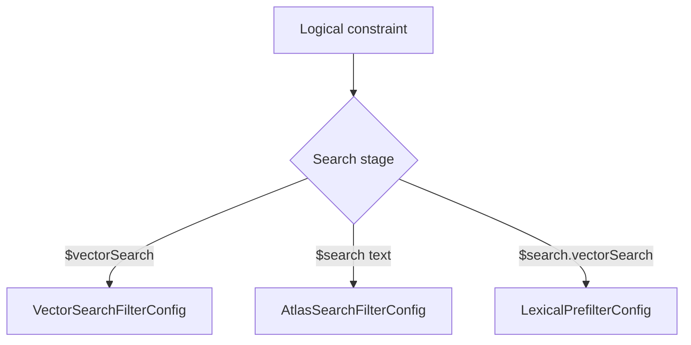

# Filters

HybridRAG has three operator-specific filter builders because MongoDB's vector and Atlas Search stages do not accept interchangeable syntax. Use the builder that matches the aggregation stage, or use the backend-neutral `FilterConfig` when calling the public retrieval path.

## The three filter systems

| Configuration | Target stage | Syntax |
| --- | --- | --- |
| `VectorSearchFilterConfig` | `$vectorSearch.filter` | MQL operators such as `$eq`, `$gte`, `$in`, and `$ne` |
| `AtlasSearchFilterConfig` | `$search.compound.filter` | Atlas operators such as `equals`, `range`, `exists`, and `compound.should` |
| `LexicalPrefilterConfig` | MongoDB 8.2 `$search.vectorSearch.filter` | Atlas lexical operators such as `text`, `phrase`, `wildcard`, `geoShape`, and `queryString` |



Never copy the output from one branch into another. For example, `{"category": {"$eq": "tech"}}` is valid for `$vectorSearch`, while `{"equals": {"path": "category", "value": "tech"}}` is valid inside Atlas Search.

## Vector search filters

`VectorSearchFilterConfig` and `build_vector_search_filters` live in `src/hybridrag/enhancements/filters/vector_search_filters.py`. The builder supports:

- `start_date` and `end_date` on a configurable timestamp field.
- Equality and membership filters.
- Direct comparison dictionaries.
- Not-equal filters.

```python
from datetime import UTC, datetime
from hybridrag.enhancements.filters import VectorSearchFilterConfig

filters = VectorSearchFilterConfig(
    start_date=datetime(2025, 1, 1, tzinfo=UTC),
    equality_filters={"metadata.tenant_id": "acme"},
    in_filters={"metadata.category": ["manual", "runbook"]},
    comparison_filters={"metadata.priority": {"$gte": 2}},
)
```

`build_vector_search_stage` places the resulting MQL object directly under `$vectorSearch.filter`. It validates configured field names against `$` injection and leading dots.

## Atlas Search compound filters

`AtlasSearchFilterConfig` in `src/hybridrag/enhancements/filters/atlas_search_filters.py` builds a list of clauses for `$search.compound.filter`. Date and numeric ranges use `range`; equality uses `equals`; required fields use `exists`.

Membership is expressed as one `equals` clause for a single value or a `compound.should` with `minimumShouldMatch: 1` for several values. Empty membership lists and ranges without a bound raise `ValueError`.

```python
from hybridrag.enhancements.filters import AtlasSearchFilterConfig

filters = AtlasSearchFilterConfig(
    equality_filters={"metadata.tenant_id": "acme"},
    in_filters={"metadata.category": ["manual", "runbook"]},
    numeric_range_filters={"metadata.priority": {"gte": 2}},
    exists_filters=["metadata.owner"],
)
```

`build_compound_search_stage` combines these non-scoring filters with a fuzzy text clause in `compound.must`.

## Lexical vector prefilters

MongoDB 8.2 `$search.vectorSearch` can narrow the candidate set with Atlas Search operators before vector similarity is evaluated. `LexicalPrefilterConfig` in `src/hybridrag/enhancements/filters/lexical_prefilters.py` collects those clauses and `build_lexical_prefilters` wraps them in:

```json
{
  "compound": {
    "filter": []
  }
}
```

The typed filter shapes are:

| Type | Required fields | Main options |
| --- | --- | --- |
| `TextFilter` | `path`, `query` | Optional Atlas `fuzzy` and `score` objects |
| `FuzzyFilter` | `path`, `query` | `maxEdits`, `prefixLength`, `maxExpansions` |
| `PhraseFilter` | `path`, `query` | Optional `slop` |
| `WildcardFilter` | `path`, `query` | Optional `allowAnalyzedField` |
| `GeoFilter` | `path`, `geometry` | `relation`: `contains`, `disjoint`, `intersects`, or `within` |
| `QueryStringFilter` | `defaultPath`, `query` | Lucene-style query string |

The config also supports `range_filters` and simple `equality_filters`.

```python
from hybridrag.enhancements.filters import LexicalPrefilterConfig

filters = LexicalPrefilterConfig(
    fuzzy_filters=[
        {
            "path": "metadata.product",
            "query": "mongdb",
            "maxEdits": 1,
            "prefixLength": 2,
        }
    ],
    phrase_filters=[
        {"path": "content", "query": "change stream", "slop": 1}
    ],
    wildcard_filters=[
        {"path": "metadata.version", "query": "8.*"}
    ],
    query_string_filter={
        "defaultPath": "content",
        "query": "replica AND rollback",
    },
)
```

`build_search_vector_search_stage` builds the complete `$search.vectorSearch` stage. Approximate search includes `numCandidates`, defaulting to `limit * 20`. Exact search sets `exact: true` and omits `numCandidates` because the two options are mutually exclusive.

## Backend-neutral public filters

`FilterConfig` and `FilterPredicate` in `src/hybridrag/enhancements/filters/vector_search_filters.py` are the public expression model. One config contains 1–32 predicates, applies `and` or `or` logic, and can negate the expression. Supported operators are `eq`, `ne`, `gt`, `gte`, `lt`, `lte`, `in`, `nin`, and `exists`.

```python
from hybridrag.enhancements.filters import FilterConfig, FilterPredicate

public_filter = FilterConfig(
    predicates=[
        FilterPredicate(
            field="metadata.category",
            operator="in",
            value=["manual", "runbook"],
        ),
        FilterPredicate(
            field="metadata.priority",
            operator="gte",
            value=2,
        ),
    ],
    logic="and",
)
```

`compile_filter_to_mql` and `compile_filter_to_atlas` translate the same expression to the correct backend syntax. Values support strings, finite numbers, booleans, timezone-aware datetimes, dates, ObjectIds, UUIDs, and tagged JSON forms for ObjectId, UUID, date, and datetime. Membership lists must contain 1–100 values of one BSON type.

`RetrievalSecurityContext` keeps server-owned mandatory expressions separate from caller filters. `compile_retrieval_filter_to_mql` and `compile_retrieval_filter_to_atlas` always combine mandatory and public constraints with conjunction, so callers cannot replace tenant or ownership boundaries.

Search mappings still matter. `validate_filter_config_for_mappings` checks values against configured `token`, `number`, `date`, `boolean`, `objectId`, or `uuid` field types before a query is built.

## Metadata ingestion

`normalize_document_metadata` in `src/hybridrag/enhancements/filters/metadata.py` validates the data that filters will later query. It allows at most 32 safe top-level metadata keys, rejects dots, dollar signs, null bytes, and unsupported values, and normalizes dates and UUIDs to stable BSON forms. `normalize_metadata_batch` also requires one metadata object per ingested document.

## Key source files

| File | Purpose |
| --- | --- |
| `src/hybridrag/enhancements/filters/vector_search_filters.py` | Public predicates, BSON normalization, security constraints, and MQL vector filters |
| `src/hybridrag/enhancements/filters/atlas_search_filters.py` | Atlas compound filter configuration and stage builder |
| `src/hybridrag/enhancements/filters/lexical_prefilters.py` | MongoDB 8.2 lexical vector prefilters and typed filter shapes |
| `src/hybridrag/enhancements/filters/metadata.py` | Ingestion-time metadata validation and normalization |
| `src/hybridrag/enhancements/filters/__init__.py` | Public filter exports |

See [Hybrid search](hybrid-search.md) for where each filter model enters the retrieval pipelines.
