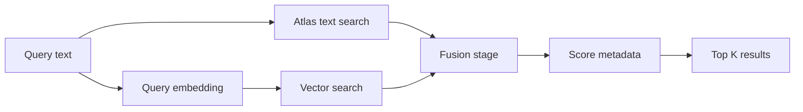

# Hybrid search

Hybrid search combines semantic vector similarity with lexical Atlas Search. `src/hybridrag/enhancements/mongodb_hybrid_search.py` can fuse the two ranked branches with MongoDB-native reciprocal-rank fusion (`$rankFusion`), normalized weighted score fusion (`$scoreFusion`), or a manual RRF fallback.

## Retrieval flow



Both native fusion builders use named `vector` and `text` input pipelines. The vector branch searches `MongoDBHybridSearchConfig.vector_path`; the text branch searches `text_search_path` with the configured Atlas Search index. The final stages read the fusion score through `{"$meta": "score"}`, limit the result set to `top_k`, and exclude the stored vector.

## Fusion strategies

### Reciprocal-rank fusion

`hybrid_search_with_rank_fusion` in `src/hybridrag/enhancements/mongodb_hybrid_search.py` uses `$rankFusion`. It combines each document's position in the two ranked lists rather than comparing raw vector and text scores:

```text
RRF(d) = Σ 1 / (k + rank_i(d))
```

MongoDB applies the configured `vector_weight` and `text_weight` through `combination.weights`. Rank fusion is useful when the two branches expose scores on different scales or when rank position is the more stable signal.

The function can build its vector branch as either:

- `$vectorSearch`, which accepts MQL prefilters.
- MongoDB 8.2 `$search.vectorSearch`, which accepts lexical Atlas Search prefilters.

The direct legacy helper rejects any independent `VectorSearchFilterConfig`, `AtlasSearchFilterConfig`, or `LexicalPrefilterConfig`, because it cannot prove those separate models enforce equivalent constraints. The main HybridRAG retrieval path instead passes the backend-neutral `FilterConfig` and `RetrievalSecurityContext` through the storage implementation. See [Filters](filters.md).

### Weighted score fusion

`hybrid_search_with_score_fusion` uses `$scoreFusion`. Its `input.normalization` is `"sigmoid"`, then the expression combines the normalized branch scores:

```text
final = vector_weight × vector_score + text_weight × text_score
```

The defaults are `0.6` for vector and `0.4` for text. Score fusion is the default in `MongoDBHybridSearcher.hybrid_search`; pass `use_rank_fusion=True` to select native RRF. In the main query engine, `QueryParam.fusion_strategy` selects `"score"` or `"rank"`, and `_get_vector_context` in `src/hybridrag/engine/operate.py` forwards that choice to the storage layer.

### Manual RRF

`manual_hybrid_search_with_rrf` runs `vector_only_search` and `text_only_search` concurrently with `asyncio.gather`, then merges the lists through `reciprocal_rank_fusion`. Duplicate chunks are identified by `chunk_id`, their rank contributions are summed with `DEFAULT_RRF_CONSTANT = 60`, and the result is sorted by the combined value.

This path also degrades to the successful branch when only vector or text retrieval returns results.

## Branch over-fetching

Fusion quality depends on the candidate pool, not only the final limit. `MongoDBHybridSearchConfig.branch_limit` computes the limit inside each input pipeline:

```python
branch_limit = max(
    top_k * config.branch_overfetch_factor,
    config.branch_overfetch_floor,
)
```

The defaults are a factor of `4` and a floor of `20`. A request for five final results therefore gives each branch 20 candidates; a request for ten gives each branch 40.

The vector `numCandidates` value is based on this branch limit, not the final `top_k`:

```python
num_candidates = min(branch_limit * 20, 10_000)
```

Set `vector_num_candidates` for an explicit override. The config validates overrides to the range 1–10,000. It also requires `branch_overfetch_factor >= 1` and `branch_overfetch_floor >= 0`.

## Score details

The `$rankFusion` pipeline always sets `scoreDetails: true` and projects both:

```python
{
    "$addFields": {
        "hybrid_score": {"$meta": "score"},
        "score_details": {"$meta": "scoreDetails"},
    }
}
```

`extract_pipeline_score` walks the metadata's `details` array by `inputPipelineName`. Formatted rank-fusion results expose:

- `score`: the fused score.
- `source_scores.vector`: the vector branch contribution.
- `source_scores.text`: the text branch contribution.
- `score_details`: the raw MongoDB diagnostic object.
- `search_type`: `hybrid_rrf` or `hybrid_rrf_filtered`.

The `$scoreFusion` builder also requests `scoreDetails`, but its current result formatter exposes only the fused `score` and `search_type="hybrid_score_fusion"`. Extend its `$addFields` and formatter if per-branch score diagnostics are needed there too.

## Related search paths

The same module contains focused retrieval helpers:

| Function | Behavior |
| --- | --- |
| `vector_only_search` | Runs `$vectorSearch`, reads `vectorSearchScore`, applies the cosine threshold, and can join parent-document metadata. |
| `vector_search_with_lexical_prefilters` | Runs MongoDB 8.2 `$search.vectorSearch` and reads `searchScore`. |
| `text_only_search` | Runs fuzzy Atlas Search over one or more paths and can apply compound filters. |
| `multi_field_text_search` | Builds one boosted text clause per configured field. |
| `create_text_search_index_if_not_exists` | Creates a static Atlas Search string mapping when the named index is absent. |

All aggregation calls set `allowDiskUse=True` and use `MONGO_AGGREGATE_TIMEOUT_MS`, which defaults to 30 seconds.

## Practical configuration

```python
from hybridrag.enhancements.mongodb_hybrid_search import (
    MongoDBHybridSearchConfig,
    MongoDBHybridSearcher,
)

config = MongoDBHybridSearchConfig(
    vector_index_name="vector_knn_index",
    text_index_name="text_search_index",
    text_search_path=["content", "metadata.title"],
    vector_weight=0.7,
    text_weight=0.3,
    branch_overfetch_factor=4,
    branch_overfetch_floor=20,
)

searcher = MongoDBHybridSearcher(db, workspace="acme", config=config)
results = await searcher.hybrid_search(
    namespace="text_chunks",
    query_text="change streams resume token",
    query_vector=query_embedding,
    top_k=10,
    use_rank_fusion=True,
)
```

When a workspace is set, `MongoDBHybridSearcher` prefixes the collection and derives workspace-specific vector and text index names while preserving the rest of the config.

## Key source files

| File | Purpose |
| --- | --- |
| `src/hybridrag/enhancements/mongodb_hybrid_search.py` | Fusion pipeline builders, branch sizing, score extraction, and focused search helpers |
| `src/hybridrag/engine/operate.py` | Selects the fusion strategy for query-time chunk retrieval |
| `src/hybridrag/enhancements/filters/` | Builds the filter syntax accepted by each search operator |

For the wider request path around these builders, see [Architecture](../overview/architecture.md).
