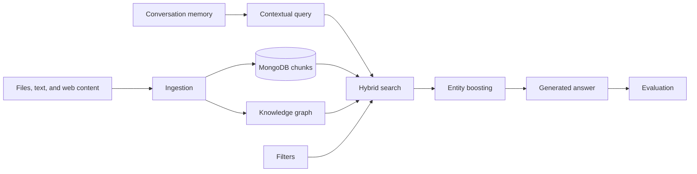

# Features

HybridRAG combines MongoDB-native retrieval, knowledge-graph context, document ingestion, conversation memory, reranking, and quality evaluation. Start with [Hybrid search](hybrid-search.md) for the primary retrieval path or [Architecture](../overview/architecture.md) for the system-wide view.

## Feature pages

| Feature | Description |
| --- | --- |
| [Hybrid search](hybrid-search.md) | Combines vector and Atlas text retrieval with native `$rankFusion` or `$scoreFusion`, branch over-fetching, and score diagnostics. |
| [Knowledge graph](knowledge-graph.md) | Extracts entities and relations from chunks, persists a MongoDB graph, and supports local, global, hybrid, and multi-hop traversal. |
| [Filters](filters.md) | Explains the separate MQL, Atlas compound, and MongoDB 8.2 lexical prefilter syntaxes and their builders. |
| [Conversation memory](conversation-memory.md) | Stores sessions and messages in bounded MongoDB collections and compacts old turns into a running summary. |
| [Ingestion](ingestion.md) | Converts files to markdown, creates structure-aware chunks, embeds them, and stores documents and chunks atomically. |
| [Entity boosting](entity-boosting.md) | Adds query-relevant entity overlap to a base reranker's semantic relevance score. |
| [Evaluation](evaluation.md) | Runs RAGAS faithfulness, relevance, recall, and precision metrics over a JSON test set. |

## How the features connect

## Key source areas

| Path | Purpose |
| --- | --- |
| `src/hybridrag/enhancements/` | Search, filtering, and reranking features |
| `src/hybridrag/engine/` | Knowledge-graph extraction, storage, and query flow |
| `src/hybridrag/ingestion/` | Document conversion, chunking, embedding, and persistence |
| `src/hybridrag/memory/` | MongoDB-backed conversation sessions |
| `src/hybridrag/evaluation/` | RAGAS evaluation runner and sample dataset |
