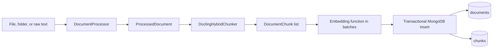

# Ingestion

The ingestion subsystem converts files or raw text into normalized document records and searchable chunks. It uses Docling for rich document formats, a structure-aware hybrid chunker when possible, caller-supplied embeddings, and MongoDB transactions for document-plus-chunk persistence.

## Pipeline

`DocumentIngestionPipeline` in `src/hybridrag/ingestion/pipeline.py` is the batch entry point.



`ingest_folder` recursively discovers supported extensions, optionally clears the target collections, and processes files in stable sorted order. `ingest_file` runs conversion, chunking, embedding, and storage. `ingest_text` skips file conversion and uses the chunker's text fallback.

`IngestionResult` reports the document ID, title, chunk count, elapsed milliseconds, source, format, and errors. Its `success` property requires at least one chunk and no errors.

## Document processing

`DocumentProcessor` in `src/hybridrag/ingestion/document_processor.py` routes by file extension:

| Input | Processing path |
| --- | --- |
| PDF, Word, PowerPoint, Excel, HTML, Markdown | Docling `DocumentConverter`, exported to markdown |
| MP3, WAV, M4A, FLAC, OGG, WebM | Docling ASR pipeline with Whisper Turbo |
| TXT, RST, JSON, YAML, CSV | Direct text read, UTF-8 then Latin-1 fallback |

The returned `ProcessedDocument` keeps markdown content, title, source, file metadata, format type, and the original Docling document when available. Keeping that object lets the chunker use headings, sections, tables, and semantic boundaries rather than chunking only the exported text.

If Docling conversion fails for a PDF, the processor tries PyMuPDF text extraction, then a plain text read. Other Docling failures fall back directly to text reading. Unsupported extensions and disabled audio processing raise `ValueError`.

Web content can enter the same model through the optional `TavilyProcessor` in `src/hybridrag/ingestion/tavily_processor.py`. `extract_url` and `crawl_website` return `ProcessedDocument` objects with source and extraction metadata, but they are not automatically persisted by `DocumentIngestionPipeline`.

## Structure-aware chunking

`DoclingHybridChunker` in `src/hybridrag/ingestion/chunker.py` lazily initializes:

- A Hugging Face tokenizer selected by `ChunkingConfig.tokenizer_model`.
- Docling's `HybridChunker` with `max_tokens` and `merge_peers`.

For a Docling document, each chunk is contextualized so heading hierarchy accompanies the content. Token counts come from the actual tokenizer. Chunk metadata records the source, title, total chunk count, token count, and `has_context=True`.

The fallback chunker uses a character sliding window. It tries to stop at `.`, `!`, `?`, or a newline within the final 200 characters, then advances with the configured overlap. It uses the tokenizer for counts when available, otherwise estimates one token per four characters.

### `ChunkingConfig`

| Option | Default | Used by |
| --- | ---: | --- |
| `max_tokens` | 512 | Docling hybrid chunks |
| `chunk_size` | 1,000 characters | Fallback target size |
| `chunk_overlap` | 200 characters | Fallback overlap |
| `max_chunk_size` | 2,000 characters | Configuration field; not currently read by the fallback loop |
| `min_chunk_size` | 100 characters | Lower bound while searching for a sentence boundary |
| `tokenizer_model` | `sentence-transformers/all-MiniLM-L6-v2` | Tokenizer initialization |
| `merge_peers` | `True` | Docling adjacent-chunk merging |

Configuration validation requires positive `max_tokens` and `min_chunk_size`, and overlap smaller than chunk size.

## Embedding and storage

The pipeline calls the supplied embedding function in `IngestionConfig.batch_size` batches, using `asyncio.to_thread` because the function has a synchronous batch interface. It attaches vectors to chunks and rejects inconsistent embedding dimensions.

Before writing, `_store_document` hashes normalized document content with SHA-256. If the same `content_hash` already exists, it returns the existing document ID instead of inserting a duplicate.

New writes use `run_with_transaction`:

1. Insert the parent document.
2. Attach its `_id` to every chunk.
3. Insert all chunks with `ordered=False`.

This prevents orphaned parent records when transactions are available and uses the project's transaction fallback on standalone or M0 deployments.

The pipeline creates conventional indexes for `document_id`, `metadata.source`, document/chunk order, source, and descending creation time. Atlas Search and vector indexes are managed separately; see [Hybrid search](hybrid-search.md).

## Configuration and usage

`IngestionConfig` combines chunking, embedding batch size, audio support, and cleanup policy. `clean_before_ingest` defaults to `True`, so a folder ingestion clears both configured collections before processing. Set it to `False` for additive ingestion.

```python
from hybridrag.ingestion import (
    ChunkingConfig,
    DocumentIngestionPipeline,
    IngestionConfig,
)

config = IngestionConfig(
    chunking=ChunkingConfig(max_tokens=512, merge_peers=True),
    clean_before_ingest=False,
    batch_size=64,
    enable_audio_transcription=False,
)

pipeline = DocumentIngestionPipeline(
    db=db,
    embedding_func=embed_batch,
    config=config,
)
results = await pipeline.ingest_folder("./documents")
```

## Key source files

| File | Purpose |
| --- | --- |
| `src/hybridrag/ingestion/pipeline.py` | Discovery, orchestration, embedding batches, indexes, deduplication, and persistence |
| `src/hybridrag/ingestion/document_processor.py` | File routing and conversion to `ProcessedDocument` |
| `src/hybridrag/ingestion/chunker.py` | Docling hybrid chunking and character-window fallback |
| `src/hybridrag/ingestion/types.py` | Chunk, document, configuration, and result dataclasses |
| `src/hybridrag/ingestion/tavily_processor.py` | Optional URL extraction and website crawling |

The resulting metadata can be constrained at retrieval time with [Filters](filters.md).
