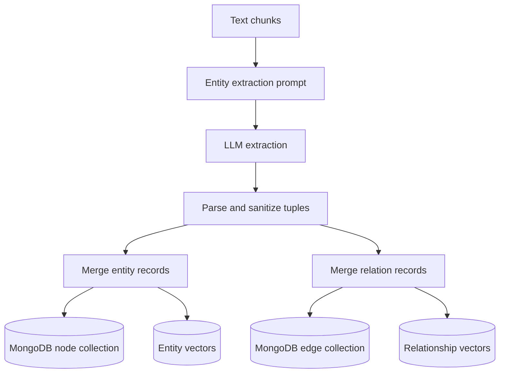
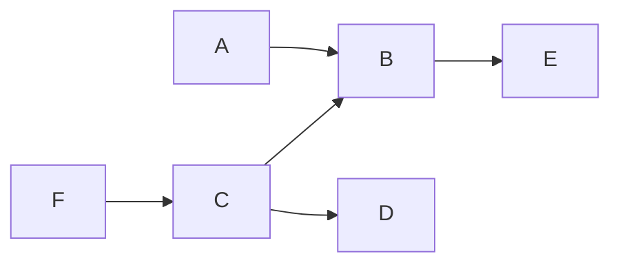

# Knowledge graph

HybridRAG builds a graph of entities and relationships from document chunks, stores nodes and edges in MongoDB, and uses separate entity and relationship vector indexes for retrieval. Query modes decide whether context starts from entities, relations, or both.

## Construction pipeline

Entity extraction is orchestrated by `extract_entities` in `src/hybridrag/engine/operate.py`. Each chunk is sent to the configured LLM with the extraction prompts in `src/hybridrag/engine/prompt.py`. Concurrency is bounded by `llm_model_max_async`, and extraction calls can be cached by chunk.

The output parser expects two record shapes:

- Entity: name, type, and description, plus the source chunk, file path, and timestamp supplied by the pipeline.
- Relation: source entity, target entity, keywords, and description. Weight defaults to `1.0` if no numeric value is available.

`_handle_single_entity_extraction` sanitizes names, normalizes entity types to lowercase without spaces, and rejects blank names, invalid types, and blank descriptions. `_handle_single_relationship_extraction` sanitizes both endpoints and drops self-relations.

When `entity_extract_max_gleaning` is greater than zero, the pipeline makes one continuation extraction pass. For duplicate entities or relations, the version with the longer description wins before centralized merge and upsert. `merge_nodes_and_edges` then reconciles extracted records with the existing graph and vector stores.

## MongoDB graph model

`MongoGraphStorage` in `src/hybridrag/engine/kg/mongo_impl.py` stores the graph in two workspace-scoped collections:

| Collection | Important fields |
| --- | --- |
| Node collection | `_id`, `entity_id`, `entity_type`, `description`, `source_id`, `source_ids`, `file_path`, `created_at` |
| `<node collection>_edges` | `source_node_id`, `target_node_id`, `relationship`, `description`, `keywords`, `weight`, `source_id`, `source_ids` |

Node IDs are entity labels. Edges are treated as bidirectional for existence checks, retrieval, normalization, and most editing operations even though each stored edge retains source and target fields. `source_ids` is derived from the separator-delimited `source_id` and capped at 500 entries to avoid unbounded arrays.

`src/hybridrag/engine/utils_graph.py` provides graph mutation operations such as `acreate_entity`, `acreate_relation`, `aedit_entity`, `adelete_by_entity`, and `amerge_entities`. These operations keep the graph, vector representations, and optional entity-to-chunk and relation-to-chunk tracking stores synchronized. Keyed locks serialize edits to the same entities or relation.

## Multi-hop traversal with `$graphLookup`

`MongoGraphStorage.get_knowledge_subgraph_in_out_bound_bfs` performs two traversals from the requested node:

1. Outbound traversal follows `target_node_id` from edges whose `source_node_id` matches the current frontier.
2. Inbound traversal follows `source_node_id` from edges whose `target_node_id` matches the current frontier.

The method runs one `$graphLookup` and a second branch through `$unionWith`, then combines the returned edges. MongoDB counts the first hop as depth zero, so the implementation subtracts one from the user-facing `max_depth`. Edges are sorted by ascending traversal depth and descending weight before the `max_nodes` cap is applied.

Starting at `B`, the outbound branch reaches `E`; the inbound branch reaches `A`, `C`, and then `F`. The two-branch pipeline includes both directions in the returned subgraph.

The edge collection has single-field indexes on `source_node_id` and `target_node_id` for `$graphLookup` and direct adjacency queries. Set `MONGO_GRAPH_BFS_MODE=in_out_bound` to use the aggregation traversal. The default `bidirectional` mode uses application-level breadth-first traversal over direct MongoDB queries instead.

`get_knowledge_graph("*")` follows a different path: it returns the whole graph when it fits, or ranks nodes by total inbound plus outbound degree and keeps the highest-degree nodes when `max_nodes` would be exceeded. The configured `max_graph_nodes` is always an upper bound.

## Query modes

The query pipeline in `src/hybridrag/engine/operate.py` first extracts high-level and low-level keywords, then `_perform_kg_search` applies the selected mode:

| Mode | Starting signal | Retrieved graph context |
| --- | --- | --- |
| `local` | Low-level keywords | Similar entities from the entity vector store, then their highest-ranked adjacent relations |
| `global` | High-level keywords | Similar relations from the relationship vector store, then the entities at their endpoints |
| `hybrid` | Both keyword sets | Local entity-first and global relation-first results, merged and deduplicated |
| `mix` | Both keyword sets plus the raw query | Hybrid graph results plus chunk-level vector or native hybrid retrieval |

Local and global lists are merged round-robin so one signal does not consume the entire context. Entity duplicates are removed by `entity_name`; relation duplicates are removed by their normalized endpoint pair. The later stages truncate entities and relations to token budgets, resolve their source chunks, merge them with direct vector chunks in `mix` mode, and build the final LLM context.

The graph modes used for answer retrieval are separate from `get_knowledge_graph`'s visualization-oriented multi-hop traversal. Local and global retrieval begin with vector search over entity or relation descriptions, then use batched node and edge lookups.

## Extending the graph

- Change extraction format or examples in `src/hybridrag/engine/prompt.py`, then update the parsers in `src/hybridrag/engine/operate.py` together.
- Change graph persistence or traversal in `MongoGraphStorage` in `src/hybridrag/engine/kg/mongo_impl.py`.
- Add safe graph editing behavior in `src/hybridrag/engine/utils_graph.py`, keeping graph records, vectors, and chunk tracking in sync.

## Key source files

| File | Purpose |
| --- | --- |
| `src/hybridrag/engine/operate.py` | LLM extraction, tuple parsing, record merge, and local/global/hybrid query flow |
| `src/hybridrag/engine/prompt.py` | Entity and relationship extraction prompt templates |
| `src/hybridrag/engine/kg/mongo_impl.py` | MongoDB graph storage, adjacency operations, indexes, and traversal |
| `src/hybridrag/engine/utils_graph.py` | Entity and relation create, edit, delete, and merge operations |

Knowledge-graph context is merged with direct retrieval in `mix` mode; see [Hybrid search](hybrid-search.md).
