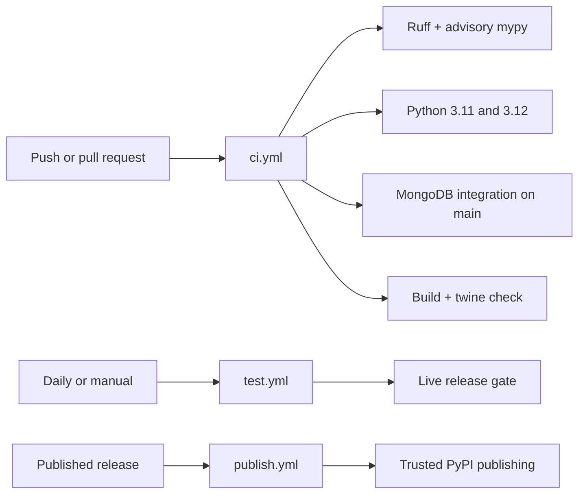

# Tooling

The repository uses setuptools for packaging, Make for repeatable commands, Ruff plus formatter tooling for code quality, and GitHub Actions for continuous integration and publication.

## Packaging

`pyproject.toml` declares `setuptools.build_meta` with `setuptools>=68.0` and `wheel`. Packages are discovered under `src/`, and the distribution is named `mongodb-hybridrag`.

```bash
make build
```

This installs `build`, creates source and wheel distributions in `dist/`, and mirrors the package-build step in `.github/workflows/ci.yml`.

## Formatting, linting, and typing

| Tool | Configuration | Role |
| --- | --- | --- |
| Ruff | `pyproject.toml` | E/W/F/I/B/C4/UP lint rules; 88-character line length; Python 3.11 target |
| Ruff formatter | `.pre-commit-config.yaml` | Commit-time formatting |
| Black | `pyproject.toml` | Manual formatting, 88-character lines |
| isort | `pyproject.toml` | Imports using the Black profile |
| mypy | `pyproject.toml` | Advisory type checking with missing imports ignored |

```bash
make lint
make format
make typecheck
```

CI pins Ruff 0.11.6 and checks both `ruff check` and `ruff format --check`. Mypy is non-blocking because the repository has pre-existing type errors; new public functions should still have complete type hints.

## Pre-commit

Install and run the hooks:

```bash
pip install pre-commit
pre-commit install
pre-commit run --all-files
```

`.pre-commit-config.yaml` checks YAML and JSON, fixes final newlines and trailing whitespace, detects case conflicts and merge markers, rejects added files larger than 1 MB, and runs Ruff with fixes plus Ruff formatting. Mypy is intentionally not a pre-commit hook.

## Make targets

| Area | Targets |
| --- | --- |
| Setup | `setup`, `install`, `install-dev`, `install-all`, `first-time-setup` |
| Local MongoDB | `mongo-up`, `mongo-down`, `atlas-check`, `atlas-indexes` |
| Run | `dev`, `run-api`, `run-ui`, `run-cli`, `notebooks` |
| Demo | `demo`, `demo-full` |
| Tests | `test`, `test-quick`, `test-cov`, `test-integration`, `example-smoke`, `contract-tests` |
| Release checks | `release-gate-fast`, `release-gate-live` |
| Quality | `lint`, `format`, `typecheck`, `audit`, `check`, `ci` |
| Build | `build`, `docker`, `clean` |

Run `make help` for the descriptions generated from the Makefile.

## Continuous integration



- `.github/workflows/ci.yml` runs on pushes and pull requests to `main`.
- `.github/workflows/test.yml` runs daily and manually; it includes the full non-integration suite, a local live gate, an optional Atlas cloud smoke test, and benchmarks.
- `.github/workflows/publish.yml` builds distributions and publishes through PyPI trusted publishing on a release or manual dispatch.

See [Development workflow](development-workflow.md) for the PR sequence and [Deployment](../deployment.md) for container and release behavior.
