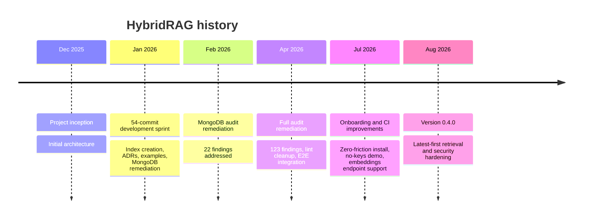

# Project lore

HybridRAG grew from an initial MongoDB-native RAG architecture into a release-hardened Python library over eight months. Its history is marked by one large construction sprint followed by audit, onboarding, and correctness passes.

## Timeline

## Inception, December 2025

The first 14 commits established the project and its basic architecture: a Python RAG library centered on MongoDB rather than a collection of separate vector, graph, and document databases. That choice became [ADR-0001](background/design-decisions.md#single-database-architecture).

## The main build-out, January 2026

January's 54 commits formed the largest development period in the repository's history. The work added index creation, examples, architectural decision records, and MongoDB-specific remediation. The decisions made then still define the system: Voyage embeddings, centralized prompts, and separate filter translations for MongoDB query syntax and Atlas Search syntax.

This period also established the engine subsystems that remain active in `src/hybridrag/engine/base_engine.py`, `src/hybridrag/engine/operate.py`, and `src/hybridrag/engine/kg/mongo_impl.py`.

## Audit cycles, February and April 2026

February focused on remediation from a MongoDB audit with 22 findings. April widened the review: 123 findings were addressed alongside lint cleanup and end-to-end integration work. These passes shifted the project from feature construction toward operational correctness, index discipline, and reproducible validation.

## Onboarding, July 2026

July's ten commits reduced setup friction. The repository added a zero-friction installation path, a 60-second demo that does not require API keys, CI fixes, and support for the MongoDB-hosted embeddings endpoint. The current entry points in `Makefile`, `.env.example`, and `scripts/demo.py` reflect this effort.

## Release hardening, August 2026

Version 0.4.0 made latest-first retrieval behavior explicit. The final four commits hardened:

- latest-first search semantics and explicit capability failures;
- tenant ownership boundaries during ingestion, retrieval, and deletion;
- a functional search-index synchronization probe;
- complete BSON-to-JSON conversion coverage;
- `numCandidates` and configuration propagation.

The policy is recorded in `docs/adr/0008-latest-first-search-capabilities.md`: requested retrieval semantics must execute as declared or fail with a typed error. Silent fallback is no longer acceptable when it could change ranking or remove mandatory evidence constraints.

## Long-standing foundations

The single-database design and async engine abstractions date to the first development era and remain central. MongoDB still stores documents, chunks, graph nodes, graph edges, vector data, status records, and LLM cache entries. The storage implementations in `src/hybridrag/engine/kg/mongo_impl.py` continue to expose asynchronous operations throughout.

## Decisions that changed

Two early choices were superseded rather than erased:

- `docs/adr/0003-hybrid-search-rrf.md` originally made rank fusion the default. `docs/adr/0008-latest-first-search-capabilities.md` changed the default to score fusion while keeping rank fusion as an explicit option.
- `docs/adr/005-automated-embedding-consideration.md` deferred server-side Automated Embedding. ADR-0008 reopened it as an active implementation track while retaining separate chunk and knowledge-graph concerns.

The collection naming ADR proposed moving from collection-per-workspace to shared collections with a tenant field. The current MongoDB engine still implements workspace-prefixed collection names, so that ADR is best read as direction and migration context, not a completed schema migration.

For the technical rationale behind these changes, see [Design decisions](background/design-decisions.md). For the current quantitative snapshot, see [By the numbers](by-the-numbers.md).
