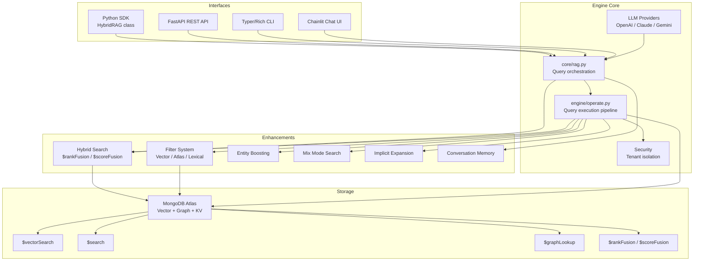
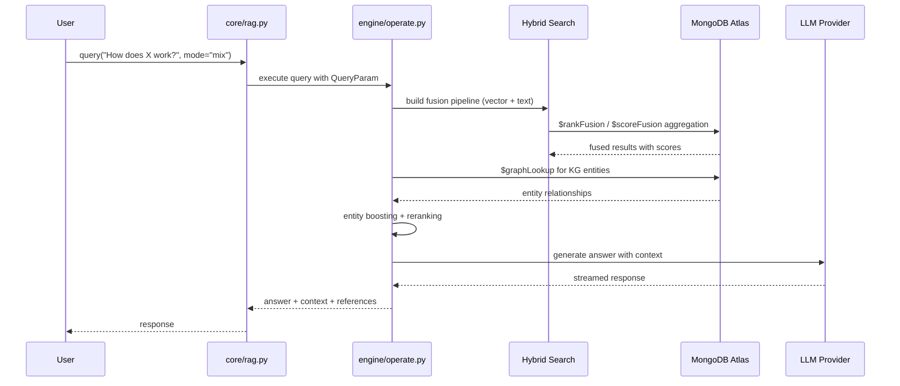
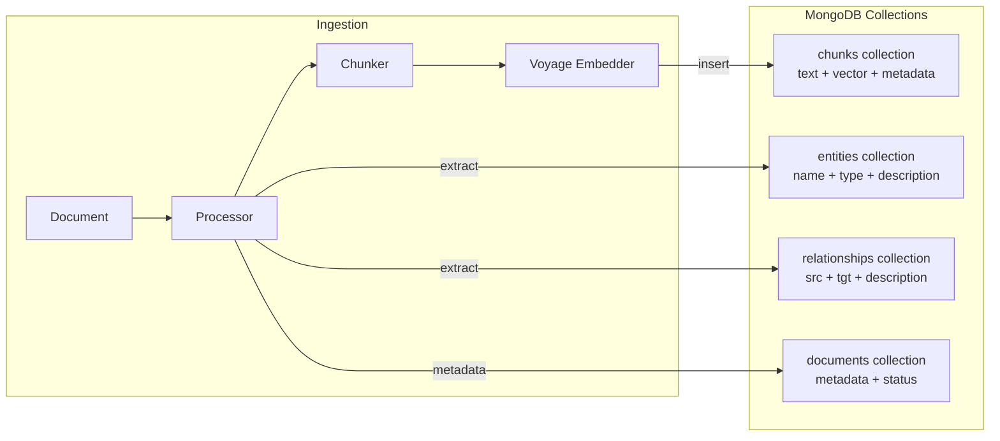

# Architecture

HybridRAG is a layered Python library with MongoDB Atlas as the single data store. The architecture has four tiers: a public API surface (SDK, REST, CLI, UI), an enhancement layer (hybrid search, filters, entity boosting, memory), an engine core (query execution, LLM orchestration, storage), and the MongoDB storage implementation.

## System diagram

## Query flow

When a user calls `rag.query()`, the request flows through these stages:

## Data flow

All data lives in MongoDB. A single document contains the text chunk, vector embedding, metadata, and graph entity references. This makes updates atomic: vector + metadata + graph in one transaction, never inconsistent.

## Key architectural decisions

- **Single database**: MongoDB Atlas handles vectors, graphs, key-value, and metadata. No Pinecone, Neo4j, or Redis. See [design decisions](../background/design-decisions.md) for the full ADR list.
- **MongoDB 8.2+ features**: The library uses `$rankFusion`, `$scoreFusion`, and `$search.vectorSearch` with lexical prefilters. Capability is probed by execution, not by version number.
- **Blessed stack**: One supported path (MongoDB + Voyage + OpenAI-compatible LLM) is exercised by the release gate. Unsupported capabilities fail explicitly.
- **Async-first**: All public APIs are async. The storage layer uses Motor (async MongoDB driver). LLM calls are async with streaming support.
- **Filter translation**: A public `FilterConfig` translates to three backend-specific MongoDB syntaxes: MQL for `$vectorSearch`, Atlas Search compound for `$search`, and lexical prefilters for `$search.vectorSearch`. See [Filters](../features/filters.md).

## Language breakdown

The codebase is 100% Python (61,321 lines across 110 source files). It targets Python 3.11+ with full type hints. See [by the numbers](../by-the-numbers.md) for detailed statistics.
