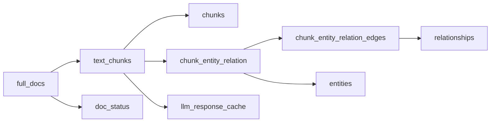

# Data models

The engine stores every persistent RAG artifact in MongoDB. Collection names come from `src/hybridrag/engine/namespace.py` and are prefixed with the resolved workspace by `src/hybridrag/engine/kg/mongo_impl.py`.

## Collection naming

With the default workspace, `default_chunks` is the vector chunk collection and `default_full_docs` is the full-document collection. An explicit empty workspace removes the prefix.

| Namespace | Storage class | Contents |
| --- | --- | --- |
| `full_docs` | `MongoKVStorage` | Original document text and metadata |
| `text_chunks` | `MongoKVStorage` | Chunk text and processing metadata |
| `chunks` | `MongoVectorDBStorage` | Searchable chunk vectors or auto-embedded chunk text |
| `entities` | `MongoVectorDBStorage` | Searchable entity summaries |
| `relationships` | `MongoVectorDBStorage` | Searchable relationship summaries |
| `chunk_entity_relation` | `MongoGraphStorage` | Graph entity nodes |
| `chunk_entity_relation_edges` | `MongoGraphStorage` | Graph edges |
| `doc_status` | `MongoDocStatusStorage` | Ingestion state |
| `llm_response_cache` | `MongoKVStorage` | LLM responses keyed by request hash |
| `full_entities`, `full_relations` | `MongoKVStorage` | Full extracted entity and relation records |
| `entity_chunks`, `relation_chunks` | `MongoKVStorage` | Provenance links back to chunks |



## Documents

`full_docs` records are created in `src/hybridrag/engine/base_engine.py` and upserted through `MongoKVStorage`.

```javascript
{
  "_id": "doc-<content-hash>",
  "content": "complete original document",
  "file_path": "/source/manual.pdf",
  "metadata": {"category": "manual", "tenant_id": "tenant-a"},
  "create_time": 1787412345,
  "update_time": 1787412345
}
```

`create_time` is set only on insert; `update_time` changes on every upsert. Tenant-aware ingestion stamps the configured ownership field before this record and its chunks are written.

## Chunks

The engine keeps a key-value chunk record in `text_chunks` and a searchable record in `chunks`. A typical logical chunk is:

```javascript
{
  "_id": "chunk-<content-hash>",
  "content": "chunk text",
  "full_doc_id": "doc-<content-hash>",
  "tokens": 287,
  "chunk_order_index": 3,
  "file_path": "/source/manual.pdf",
  "metadata": {"category": "manual", "year": 2026},
  "llm_cache_list": []
}
```

`text_chunks` receives `create_time` and `update_time` from `MongoKVStorage`. The `chunks` vector record retains `_id`, `content`, `full_doc_id`, `file_path`, `metadata`, and a Unix `created_at`; client embedding adds `vector: [float, ...]`. With `VECTOR_EMBEDDING_BACKEND=automated`, the vector index uses `content` as an `autoEmbed` field instead.

### Chunk search indexes

`MongoVectorDBStorage.build_vector_index_definition()` creates:

- a `vector` field at path `vector`, or an `autoEmbed` field at `content`;
- filter fields for `created_at`, `file_path`, and `entity_name`;
- one filter field for every configured `FILTERABLE_METADATA_FIELDS` path.

The default vector index is `vector_knn_index`; workspaced collections use `vector_knn_index_<collection>`. Client vectors default to cosine similarity, HNSW indexing, no quantization, and the embedding function's dimensions.

Chunks also have an Atlas Search index named `text_search_index_<namespace-or-collection>`. Its mapping is dynamic-disabled, indexes `content` with `lucene.standard`, and adds explicitly configured metadata fields with their declared BSON/search types.

## Entities

Graph entity nodes in `chunk_entity_relation` use the entity name as `_id`:

```javascript
{
  "_id": "CompanyA",
  "entity_id": "CompanyA",
  "entity_type": "Organization",
  "description": "A technology company",
  "source_id": "chunk-...",
  "source_ids": ["chunk-..."],
  "file_path": "custom_kg",
  "created_at": 1749904575
}
```

`MongoGraphStorage.upsert_node()` derives `source_ids` by splitting `source_id` and caps the array at 500 entries. The graph's entity-label Atlas Search definition maps `_id` as string, token, and autocomplete with 2–15 grams.

The `entities` vector collection stores:

```javascript
{
  "_id": "ent-<hash>",
  "entity_name": "CompanyA",
  "source_id": "chunk-...",
  "content": "searchable entity summary",
  "file_path": "/source/manual.pdf",
  "created_at": 1749904575,
  "vector": [/* floats */]
}
```

## Relationships

Graph relationships are stored separately in `chunk_entity_relation_edges`:

```javascript
{
  "_id": ObjectId("..."),
  "source_node_id": "CompanyA",
  "target_node_id": "ProductX",
  "relationship": "Develops",
  "description": "CompanyA develops ProductX",
  "weight": 1.0,
  "keywords": "develop, produce",
  "source_id": "chunk-...",
  "source_ids": ["chunk-..."],
  "file_path": "custom_kg",
  "created_at": 1749904575
}
```

Edge upserts treat either direction as the same pair and update the matching edge. Provenance arrays are capped at 500 entries.

The edge collection has four ordinary indexes:

| Index suffix | Keys | Use |
| --- | --- | --- |
| `edge_source_node_id` | `source_node_id ASC` | Outbound traversal |
| `edge_target_node_id` | `target_node_id ASC` | Inbound traversal |
| `edge_source_target` | `source_node_id ASC, target_node_id ASC` | Direct edge lookup |
| `edge_weight` | `weight DESC` | Importance sorting |

Index names receive the workspace prefix. The `relationships` vector collection stores searchable relation text plus `src_id`, `tgt_id`, `source_id`, `file_path`, `created_at`, and `vector`.

## Document status

`DocProcessingStatus` in `src/hybridrag/engine/base.py` defines:

```javascript
{
  "_id": "doc-<hash>",
  "content_summary": "first 100 characters...",
  "content_length": 9284,
  "file_path": "/source/manual.pdf",
  "status": "pending | processing | preprocessed | processed | failed",
  "created_at": "ISO-8601 timestamp",
  "updated_at": "ISO-8601 timestamp",
  "track_id": "optional ingestion ID",
  "chunks_count": 12,
  "chunks_list": ["chunk-..."],
  "error_msg": null,
  "metadata": {},
  "multimodal_processed": true
}
```

Status collections index status with update/create time, standalone update/create time, `_id`, `track_id`, `file_path` with Chinese numeric collation, and status plus file path. Legacy index names are migrated to workspace-prefixed names.

## LLM response cache

Cache keys use `<mode>:<cache_type>:<hash>`, generated by `generate_cache_key()` in `src/hybridrag/engine/utils.py`.

```javascript
{
  "_id": "mix:query:<hash>",
  "return": "cached model output",
  "cache_type": "query",
  "chunk_id": null,
  "original_prompt": "user prompt",
  "queryparam": {"mode": "mix"},
  "create_time": 1749904575,
  "update_time": 1749904575
}
```

Known cache types include `query`, `keywords`, `extract`, and `summary`. Streaming responses are not cached. `text_chunks.llm_cache_list` links extraction cache keys back to chunks for cleanup.

## Index lifecycle

Search indexes are not ordinary collection indexes. `MongoVectorDBStorage` and `MongoGraphStorage` expose plan, apply, wait, rollback, status, and synchronization operations in `src/hybridrag/engine/kg/mongo_impl.py`. Apply changes explicitly and wait for functional data visibility, not only `queryable=true`.

See [Configuration](configuration.md) for dimensions, embedding backend, and metadata mappings. See [Security](../security.md) for tenant metadata ownership.
