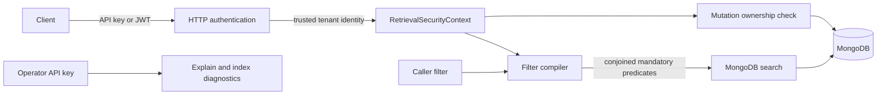

# Security

HybridRAG's security model separates caller-supplied filters from server-owned retrieval constraints. Tenant identity is derived from trusted API-key or JWT mappings, applied to ingestion and retrieval, and checked again for document mutation.

## Trust boundaries



## Retrieval security context

`RetrievalSecurityContext` in `src/hybridrag/enhancements/filters/vector_search_filters.py` contains server-owned `FilterConfig` objects that callers cannot weaken or replace. `resolve_retrieval_security_context()` in `src/hybridrag/engine/security.py` combines:

- static constraints configured on the `HybridRAG` instance;
- operation-specific constraints;
- request-scoped constraints stored in a `ContextVar`.

The MQL and Atlas filter compilers conjoin these mandatory predicates with public filters. Search paths must preserve the result or fail closed. ADR-0008 explicitly rejects fallback that silently removes evidence constraints.

## Tenant mapping

Tenant isolation is enabled by `HYBRIDRAG_TENANT_FIELD`, which must be a safe top-level metadata path such as `metadata.tenant_id`.

For API keys:

```dotenv
HYBRIDRAG_API_KEY=public-api-key
HYBRIDRAG_TENANT_FIELD=metadata.tenant_id
HYBRIDRAG_API_KEY_TENANTS={"public-api-key":"tenant-a"}
```

`api_key_security_context()` maps the authenticated key through the server-owned JSON object and creates an equality predicate for the tenant. Callers never supply the authoritative tenant value.

For JWTs, `principal_security_context()` reads `HYBRIDRAG_TENANT_CLAIM`, defaulting to `username`. A custom claim is read from the validated principal's metadata.

## Ingestion and mutation isolation

`scope_document_metadata()` in `src/hybridrag/engine/security.py` overwrites the configured tenant metadata field on every ingested document. A caller cannot assign data to a different tenant by submitting metadata.

Before deletion, `require_document_ownership()` compares stored metadata with the authenticated tenant. Missing and foreign documents both become a not-found response, reducing ownership disclosure. `require_unscoped_document_operation()` blocks collection-wide clears whenever a tenant or ACL context exists.

Workspace prefixes add another namespace boundary. `MONGODB_WORKSPACE` produces collections such as `production_chunks` through `resolve_workspace()` and `get_collection_name()` in `src/hybridrag/engine/kg/mongo_impl.py`. Workspaces are an operational partition; they do not replace request-level authorization.

## HTTP authentication

The reference API in `src/hybridrag/api/main.py` has two key classes:

| Environment field | Purpose |
| --- | --- |
| `HYBRIDRAG_API_KEY` | Optional public API protection |
| `HYBRIDRAG_OPERATOR_API_KEY` | Required for query explain and search-index diagnostics |

The operator key is compared with `secrets.compare_digest()`. Detailed diagnostics require explicit operator authentication even when the public API key is disabled.

The full engine server uses `get_combined_auth_dependency()` from `src/hybridrag/engine/api/utils_api.py`, which accepts a validated OAuth2 bearer token or configured `X-API-Key`. Route whitelists do not bypass tenant authentication for retrieval and Ollama paths when tenant mode is active.

## Additional controls

- Request models use Pydantic validation.
- Document deletion validates ObjectId syntax in the reference API.
- Internal exceptions are logged while generic errors are returned to callers.
- Query vectors are redacted from public explanation output.
- `CORS_ORIGINS` defaults to local development origins and should be set explicitly in production.
- Built-in rate limiting is optional and process-local; deploy a distributed edge or gateway limiter for multi-worker systems.
- MongoDB URI and provider keys use `SecretStr` in `src/hybridrag/config/settings.py`.

## Operator checklist

Store secrets in a managed secret store, use a least-privilege MongoDB user, restrict Atlas network access, retain TLS verification, and keep logs free of credentials or sensitive document content. Do not enable `MONGODB_TLS_ALLOW_INVALID_CERTIFICATES` in production.

Vulnerabilities should be reported privately as described in `SECURITY.md`, through `security@mongodb.com` or GitHub private vulnerability reporting, not a public issue.

See [Deployment](deployment.md) for production settings and [REST endpoints](api/rest-endpoints.md) for route-level access.
