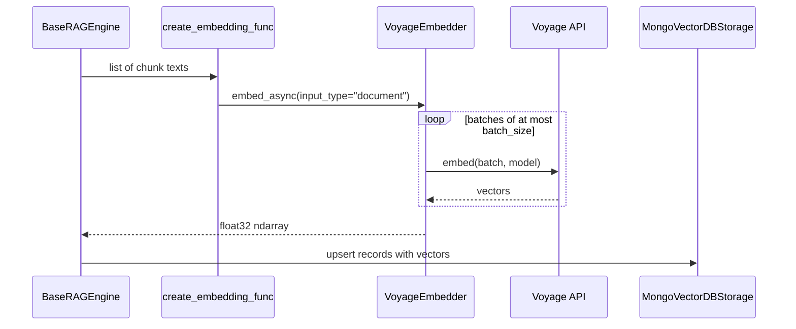

# Embeddings

HybridRAG uses Voyage AI for client-generated embeddings and external reranking. `src/hybridrag/integrations/voyage.py` wraps the synchronous and asynchronous Voyage clients, while `src/hybridrag/core/rag.py` connects the resulting callables to the [Engine](engine.md).

## Purpose

The embedding side converts document chunks and queries into vectors used by MongoDB Vector Search. The reranking side takes retrieved text candidates and assigns cross-encoder relevance scores before the engine applies its final token budget.

`Settings.embedding_provider` in `src/hybridrag/config/settings.py` only accepts `voyage`. There is no silent embedding-provider fallback: `_create_embedding_func()` in `src/hybridrag/core/rag.py` raises when `VOYAGE_API_KEY` is missing.

## Key abstractions

| Abstraction | File | Role |
| --- | --- | --- |
| `VoyageEmbedder` | `src/hybridrag/integrations/voyage.py` | Batches standard and contextualized embedding requests |
| `VoyageReranker` | `src/hybridrag/integrations/voyage.py` | Reranks candidate text with optional instructions |
| `create_embedding_func()` | `src/hybridrag/integrations/voyage.py` | Adapts `VoyageEmbedder` to the engine's async batch callable |
| `create_rerank_func()` | `src/hybridrag/integrations/voyage.py` | Adapts `VoyageReranker` to the engine's rerank callable and adds cache identity |
| `EmbeddingFunc` | `src/hybridrag/engine/utils.py` | Engine wrapper that records embedding dimensions and token limits |

## Embedding flow



`VoyageEmbedder.embed_async()` defaults to `voyage-4-large`, processes inputs in batches of 128, and retries each async batch up to three times with exponential backoff. It returns an empty `(0, 1024)` `float32` array for no inputs. `embed_sync()` provides the same batching behavior for synchronous callers.

`embed_query_async()` uses Voyage's `input_type="query"` for one query. The engine's standard factory callable uses `input_type="document"` because storage invokes it for both ingestion and query-vector generation through one generic embedding interface.

## Contextualized embeddings

`VoyageEmbedder.embed_contextualized_async()` accepts chunks grouped by source document and calls the `voyage-context-3` contextualized embedding endpoint. It flattens the per-document results into one array while preserving document and chunk order.

This method is implemented but is not connected to the main ingestion flow. The current storage layer receives flat batches, so adopting contextualized embeddings requires preserving document grouping until the embedding call.

## Reranking flow

`VoyageReranker.rerank_async()` uses `rerank-2.5` by default. It:

1. returns immediately for an empty document list;
2. prepends non-empty instructions to the query;
3. limits `top_k` to the number of supplied documents;
4. returns dictionaries containing the original index, document text, and `relevance_score`.

`create_rerank_func()` applies per-query instructions when supplied, otherwise its configured defaults. It also attaches a `cache_identity` containing provider, model, instructions, and base URL. `src/hybridrag/engine/operate.py` incorporates this identity into retrieval cache keys so a reranker configuration change does not reuse incompatible cached answers.

The public initialization path in `src/hybridrag/core/rag.py` can generate mode-aware instructions and can wrap Voyage reranking with entity boosting. Native MongoDB reranking is selected separately by `QueryParam.rerank_strategy="native"`; external Voyage reranking uses `"external"`. See [Storage](storage.md) for native search and index behavior.

## Configuration

```dotenv
VOYAGE_API_KEY=pa-...
VOYAGE_EMBEDDING_MODEL=voyage-4-large
VOYAGE_CONTEXT_MODEL=voyage-context-3
VOYAGE_RERANK_MODEL=rerank-2.5
EMBEDDING_DIM=1024
EMBEDDING_BATCH_SIZE=128
```

`VOYAGE_BASE_URL` in `src/hybridrag/config/settings.py` selects a custom endpoint. It can point to the MongoDB-hosted Voyage endpoint when using an Atlas `al-...` key instead of a direct Voyage `pa-...` key. `VOYAGE_RERANK_INSTRUCTIONS` supplies global instructions; `ENABLE_SMART_RERANK_INSTRUCTIONS` controls generated mode-aware defaults.

The configured `EMBEDDING_DIM` must match the vectors returned by the chosen model and the MongoDB vector index definition. Binary quantization also requires a dimension divisible by eight, as enforced by `MongoVectorDBStorage.build_vector_index_definition()` in `src/hybridrag/engine/kg/mongo_impl.py`.

## Direct use

```python
from hybridrag.integrations.voyage import (
    create_embedding_func,
    create_rerank_func,
)

embed = create_embedding_func(api_key="...", model="voyage-4-large")
vectors = await embed(["first chunk", "second chunk"])

rerank = create_rerank_func(api_key="...", model="rerank-2.5")
ranked = await rerank(
    "MongoDB index lifecycle",
    ["Index builds are asynchronous.", "A chunking example."],
    top_n=1,
)
```

## Entry points for modification

Change API batching, retries, input types, or output normalization in `src/hybridrag/integrations/voyage.py`. Change model names, dimensions, endpoint selection, or instruction defaults in `src/hybridrag/config/settings.py` and `src/hybridrag/core/rag.py`. Coordinate any dimension change with the vector index lifecycle in [Storage](storage.md).

## Key source files

| File | Purpose |
| --- | --- |
| `src/hybridrag/integrations/voyage.py` | Voyage embedding and reranking clients and factories |
| `src/hybridrag/core/rag.py` | Embedding/reranker creation and engine wiring |
| `src/hybridrag/config/settings.py` | Voyage models, endpoint, batch size, dimension, and rerank settings |
| `src/hybridrag/engine/utils.py` | Engine embedding callable metadata and wrappers |
| `src/hybridrag/engine/operate.py` | Query-vector reuse, reranking, token truncation, and cache identity |
| `src/hybridrag/engine/kg/mongo_impl.py` | Vector persistence, Automated Embedding, and index definitions |
