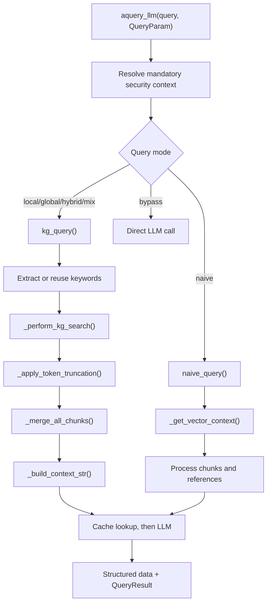

# Engine

The engine turns documents into searchable storage records and turns a query into retrieved context, references, and an optional LLM answer. `BaseRAGEngine` in `src/hybridrag/engine/base_engine.py` owns the configured collaborators, while `src/hybridrag/engine/operate.py` contains the retrieval and prompt-building algorithms.

## Purpose

`BaseRAGEngine` is a final dataclass that assembles storage interfaces, an embedding function, an optional reranker, an LLM function, token limits, chunking behavior, and workspace state. Its public surface has synchronous wrappers such as `query()` and asynchronous methods such as `aquery()`, `aquery_data()`, and `aquery_llm()`.

The storage contracts and result types live in `src/hybridrag/engine/base.py`. This keeps the pipeline independent from a concrete backend even though the public `HybridRAG` wrapper configures MongoDB implementations in `src/hybridrag/core/rag.py`.

## Directory layout

```text
src/hybridrag/engine/
├── base.py             # Query types and abstract storage contracts
├── base_engine.py      # Engine assembly and public operations
├── operate.py          # Ingestion and query algorithms
├── prompt.py           # Engine prompt templates
├── namespace.py        # Stable logical storage names
├── security.py         # Mandatory retrieval constraints
└── kg/                 # Concrete storage implementations
```

## Key abstractions

| Abstraction | File | Role |
| --- | --- | --- |
| `BaseRAGEngine` | `src/hybridrag/engine/base_engine.py` | Owns configuration, storage instances, concurrency wrappers, ingestion, querying, and deletion |
| `QueryParam` | `src/hybridrag/engine/base.py` | Per-query retrieval, token-budget, reranking, output, and security options |
| `QueryResult` | `src/hybridrag/engine/base.py` | Carries text or an async stream plus structured entities, relationships, chunks, and references |
| `BaseKVStorage` | `src/hybridrag/engine/base.py` | Contract for documents, chunks, caches, and tracking records |
| `BaseVectorStorage` | `src/hybridrag/engine/base.py` | Contract for embedding-backed retrieval and vector lifecycle operations |
| `BaseGraphStorage` | `src/hybridrag/engine/base.py` | Contract for entity/relationship access and graph traversal |
| `DocStatusStorage` | `src/hybridrag/engine/base.py` | Contract for document-processing status and pagination |
| `kg_query()` | `src/hybridrag/engine/operate.py` | Executes local, global, hybrid, and mix retrieval before optional generation |
| `naive_query()` | `src/hybridrag/engine/operate.py` | Retrieves chunks without knowledge-graph traversal |

## Engine assembly

During `BaseRAGEngine.__post_init__()` in `src/hybridrag/engine/base_engine.py`, the engine:

1. Initializes process-shared coordination state.
2. validates configured storage implementations and their environment requirements.
3. Creates a tokenizer when none was supplied.
4. Wraps embedding and LLM functions with concurrency limits and timeouts.
5. Creates logical KV stores for full documents, chunks, extracted entities and relationships, chunk associations, and the LLM cache.
6. Creates three vector stores, one graph store, and one document-status store.

`initialize_storages()` initializes these storage objects concurrently after preparing workspace-specific pipeline state. `finalize_storages()` closes each one independently so one cleanup error does not prevent the others from releasing resources. See [Storage](storage.md) for the MongoDB implementation.

## `QueryParam`

`QueryParam` in `src/hybridrag/engine/base.py` is copied before execution, so the engine can resolve mandatory security constraints without mutating the caller's object.

| Area | Important fields |
| --- | --- |
| Retrieval mode | `mode`: `local`, `global`, `hybrid`, `mix`, `naive`, or `bypass` |
| Result form | `only_need_context`, `only_need_prompt`, `stream`, `include_references` |
| Retrieval size | `top_k`, `chunk_top_k` |
| Token budgets | `max_entity_tokens`, `max_relation_tokens`, `max_total_tokens` |
| Prompt context | `conversation_history`, `history_turns`, `user_prompt`, `response_type` |
| Search behavior | `filter_config`, `fusion_strategy`, `vector_search_mode` |
| Reranking | `enable_rerank`, `rerank_strategy`, `native_rerank_model` |
| Trust boundary | `security_context`, a server-owned `RetrievalSecurityContext` |
| Model override | `model_func`, used instead of the engine-wide LLM function |

Example:

```python
from hybridrag.engine.base import QueryParam

param = QueryParam(
    mode="naive",
    top_k=30,
    chunk_top_k=8,
    fusion_strategy="score",
    vector_search_mode="ann",
    rerank_strategy="native",
    stream=False,
)

result = await engine.aquery_llm("How are indexes managed?", param)
```

## Query flow

`aquery_llm()` in `src/hybridrag/engine/base_engine.py` first combines engine-level, per-query, and request-scoped security contexts. It then selects a path by mode:

- `local`, `global`, `hybrid`, and `mix` call `kg_query()`.
- `naive` calls `naive_query()`.
- `bypass` calls the LLM directly and returns no retrieval data.



For graph-backed modes, `_build_query_context()` in `src/hybridrag/engine/operate.py` uses four stages:

1. `_perform_kg_search()` retrieves low-level entity matches, high-level relationship matches, and, for `mix`, direct chunk results. It computes one query embedding and reuses it where possible.
2. `_apply_token_truncation()` fits entity and relationship context to their budgets.
3. `_merge_all_chunks()` round-robins vector-, entity-, and relationship-derived chunks while deduplicating by chunk ID.
4. `_build_context_str()` reserves prompt and query overhead, reranks/truncates chunks, creates reference IDs, and returns both prompt context and structured raw data.

`kg_query()` then returns context or a prompt immediately when requested. Otherwise, it computes a cache key that includes retrieval filters, mandatory security filters, fusion mode, vector mode, and reranker identity before invoking the selected LLM. `naive_query()` follows the same result and cache conventions without keyword extraction or graph traversal.

## Result APIs

- `aquery()` returns only answer text or an async iterator for backward compatibility.
- `aquery_data()` forces context-only operation and returns structured retrieval data without generating an answer.
- `aquery_llm()` returns structured retrieval data and an `llm_response` object.
- `query()`, `query_data()`, and `query_llm()` run their async equivalents on the current event loop.

Use `aquery_data()` when another component will generate the answer. Use `only_need_prompt=True` when inspecting the exact prompt assembled by `src/hybridrag/engine/operate.py`.

## Integration points

- [Storage](storage.md) implements the abstract storage contracts.
- [Embeddings](embeddings.md) supplies vectors for ingestion and retrieval.
- [LLM providers](llm-providers.md) supplies the callable used for keyword extraction, summarization, and answer generation.
- [Security](security.md) adds mandatory filters before a query reaches storage.

## Entry points for modification

Change query modes, context assembly, or retrieval ordering in `src/hybridrag/engine/operate.py`. Add engine-level configuration or lifecycle behavior in `src/hybridrag/engine/base_engine.py`. When adding a new storage capability, update the abstract contract in `src/hybridrag/engine/base.py` before implementing it in a backend.

## Key source files

| File | Purpose |
| --- | --- |
| `src/hybridrag/engine/base_engine.py` | Engine configuration, dependency assembly, lifecycle, and query APIs |
| `src/hybridrag/engine/operate.py` | Chunking, extraction, retrieval, token control, prompt construction, and LLM dispatch |
| `src/hybridrag/engine/base.py` | `QueryParam`, result dataclasses, statuses, and abstract storage interfaces |
| `src/hybridrag/engine/namespace.py` | Logical names for all engine stores |
| `src/hybridrag/core/rag.py` | Public wrapper that constructs the engine with MongoDB, Voyage, and the selected LLM |
