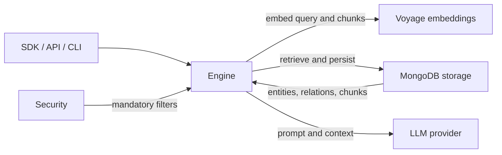

# Systems

HybridRAG's internal systems separate query orchestration, MongoDB persistence, model access, embeddings, and request-owned security constraints. Start with the [architecture](../overview/architecture.md) for the end-to-end view, then use these pages for implementation details.

| System | Description |
| --- | --- |
| [Engine](engine.md) | `BaseRAGEngine`, `QueryParam`, and the retrieval-to-generation pipeline in `src/hybridrag/engine/`. |
| [Storage](storage.md) | MongoDB key-value, document-status, graph, vector, and search-index implementations. |
| [LLM providers](llm-providers.md) | Runtime selection and adapters for Anthropic, OpenAI, Gemini, and Grove. |
| [Embeddings](embeddings.md) | Voyage AI document/query embeddings and cross-encoder reranking. |
| [Security](security.md) | Request-scoped tenant constraints, ownership enforcement, and workspace namespacing. |

## How the systems connect

## Key source files

| File | Purpose |
| --- | --- |
| `src/hybridrag/engine/base_engine.py` | Engine configuration, storage assembly, ingestion, and public query methods |
| `src/hybridrag/engine/operate.py` | Chunking, entity extraction, retrieval, context construction, and generation |
| `src/hybridrag/engine/kg/mongo_impl.py` | MongoDB storage adapters and search-index lifecycle |
| `src/hybridrag/config/settings.py` | Typed provider, embedding, MongoDB, and query settings |
| `src/hybridrag/integrations/voyage.py` | Voyage embedding and reranking adapters |
| `src/hybridrag/engine/security.py` | Request security context and tenant ownership rules |
