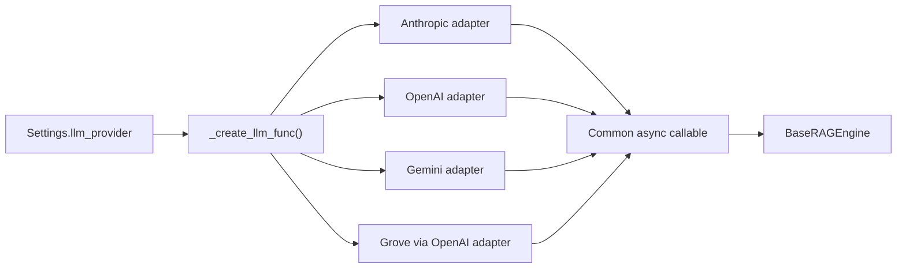

# LLM providers

HybridRAG selects one generation provider at startup and adapts it to the callable expected by the [Engine](engine.md). The supported public choices are Anthropic, OpenAI, Google Gemini, and Grove; embeddings remain a separate Voyage-only concern described in [Embeddings](embeddings.md).

## Provider selection

`Settings.llm_provider` in `src/hybridrag/config/settings.py` is a literal union of `anthropic`, `openai`, `gemini`, and `grove`, with `anthropic` as the default. `_create_llm_func()` in `src/hybridrag/core/rag.py` validates the selected provider's credentials and returns one common async callable:

```python
async def llm_func(
    prompt: str,
    system_prompt: str | None = None,
    history_messages: list | None = None,
    **kwargs,
) -> str:
    ...
```

`BaseRAGEngine` wraps this callable with its configured concurrency and timeout limiter in `src/hybridrag/engine/base_engine.py`. Query code can override it for a single request through `QueryParam.model_func`.



## Providers

| Provider | Runtime adapter | Required settings | Default model |
| --- | --- | --- | --- |
| Anthropic | `ClaudeLLM` and `create_llm_func()` in `src/hybridrag/integrations/anthropic.py` | `ANTHROPIC_API_KEY` | `claude-sonnet-4-20250514` |
| OpenAI | `OpenAILLM` and `create_openai_llm_func()` in `src/hybridrag/integrations/openai.py` | `OPENAI_API_KEY` | `gpt-4o` |
| Gemini | `GeminiLLM` and `create_gemini_llm_func()` in `src/hybridrag/integrations/gemini.py` | `GEMINI_API_KEY` | `gemini-2.5-flash` |
| Grove | OpenAI adapter with a custom URL | `GROVE_API_KEY`, `GROVE_BASE_URL` | `gpt-4o` |

### Anthropic

`ClaudeLLM.generate_async()` calls `AsyncAnthropic.messages.create()` with the system prompt in Anthropic's dedicated `system` field and the query as a user message. Its `max_tokens` can be overridden per call.

The lower-level binding in `src/hybridrag/engine/llm/anthropic.py` also supports streaming, transient-error retries, custom endpoints, Unicode cleanup, and named Claude 3 helpers. This engine binding is part of the broader provider toolkit, while the public `HybridRAG` constructor currently chooses the thin adapter in `src/hybridrag/integrations/anthropic.py`.

### OpenAI

`OpenAILLM.generate_async()` sends system and user messages through `AsyncOpenAI.chat.completions.create()`. `OPENAI_BASE_URL` and JSON-encoded `OPENAI_EXTRA_HEADERS` support compatible gateways and Azure-style front doors.

`src/hybridrag/engine/llm/openai.py` contains the richer engine binding: standard and Azure client construction, streaming, retry handling, response caching hooks, token tracking, keyword extraction, and embedding helpers.

### Gemini

`GeminiLLM.generate_async()` uses `google.genai.Client.aio.models.generate_content()`. The adapter combines the system prompt and user prompt into one content string before calling Gemini.

`src/hybridrag/engine/llm/gemini.py` provides a fuller binding with cached client creation, history formatting, structured keyword output, thought extraction, streaming support, and retries for transient Google API failures.

### Grove

Grove is an OpenAI-compatible MongoDB-internal gateway, not a separate provider module. `_create_llm_func()` in `src/hybridrag/core/rag.py` passes `GROVE_API_KEY`, `GROVE_BASE_URL`, and `GROVE_MODEL` to `create_openai_llm_func()` in `src/hybridrag/integrations/openai.py`.

This reuse means Grove follows the OpenAI chat-completions request shape. A missing key or base URL fails during engine initialization rather than falling back to another provider.

## Configuration

```dotenv
LLM_PROVIDER=openai
OPENAI_API_KEY=...
OPENAI_MODEL=gpt-4o
# Optional OpenAI-compatible endpoint:
OPENAI_BASE_URL=https://gateway.example/v1
OPENAI_EXTRA_HEADERS={"api-key":"..."}
```

Equivalent provider-specific settings are `ANTHROPIC_API_KEY` and `ANTHROPIC_MODEL`, `GEMINI_API_KEY` and `GEMINI_MODEL`, or the Grove variables above. Pydantic reads these fields from environment variables in `src/hybridrag/config/settings.py`; secrets use `SecretStr`.

Set `ENABLE_LLM=false` for retrieval-only deployments. `_create_llm_func()` then installs a no-op completion function so ingestion and context retrieval can still use the engine, while the public wrapper records that no generation model is active.

## Binding options

`BindingOptions` in `src/hybridrag/engine/llm/binding_options.py` is a dataclass-based framework for provider CLI/environment options. It derives command-line names and environment variables from each binding's `_binding_name`, parses booleans and JSON collections, and can extract provider-specific values from an `argparse.Namespace`. `GeminiLLMOptions` and `OpenAILLMOptions` specialize this mechanism.

This binding-options layer supports the engine package's wider set of provider modules. It is separate from the smaller `Settings`-driven provider switch used by the public `HybridRAG` API.

## Adding a provider

Add a typed provider name and credential/model fields to `src/hybridrag/config/settings.py`. Implement an async adapter with the common callable signature, then add a branch to `_create_llm_func()` in `src/hybridrag/core/rag.py`. If the engine CLI must expose provider-specific tuning, add a `BindingOptions` subclass and a lower-level module under `src/hybridrag/engine/llm/`.

## Key source files

| File | Purpose |
| --- | --- |
| `src/hybridrag/config/settings.py` | Public provider selection, keys, endpoints, and model defaults |
| `src/hybridrag/core/rag.py` | Runtime provider factory and validation |
| `src/hybridrag/integrations/anthropic.py` | Public Anthropic callable adapter |
| `src/hybridrag/integrations/openai.py` | Public OpenAI adapter reused by Grove |
| `src/hybridrag/integrations/gemini.py` | Public Gemini callable adapter |
| `src/hybridrag/engine/llm/openai.py` | Full OpenAI/Azure binding with streaming and retries |
| `src/hybridrag/engine/llm/anthropic.py` | Full Anthropic binding with streaming and retries |
| `src/hybridrag/engine/llm/gemini.py` | Full Gemini binding with streaming and retries |
| `src/hybridrag/engine/llm/binding_options.py` | Shared provider option and CLI/environment machinery |
