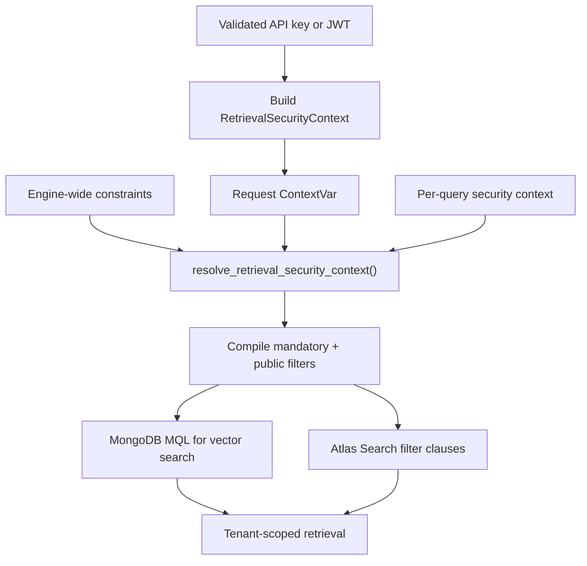

# Security

HybridRAG protects retrieval with server-owned filters and protects document mutations with ownership checks. These row-level rules complement workspace-prefixed MongoDB collections, giving deployments two distinct isolation mechanisms.

## Trust model

Caller-supplied `FilterConfig` values are useful query constraints, but they are not authorization. `RetrievalSecurityContext` in `src/hybridrag/enhancements/filters/vector_search_filters.py` holds mandatory server-owned filters that callers cannot replace or weaken.



## `RetrievalSecurityContext`

`RetrievalSecurityContext` is a frozen dataclass with one required `mandatory_filter` and optional `additional_mandatory_filters`. Its `mandatory_filters` property returns every expression in conjunction order.

`compile_retrieval_filter_to_mql()` and `compile_retrieval_filter_to_atlas()` in `src/hybridrag/enhancements/filters/vector_search_filters.py` compile mandatory filters before the public filter. Multiple MQL expressions are combined with `$and`; Atlas expressions become filter clauses. This prevents a permissive public filter from overriding tenant or ACL constraints.

```python
from hybridrag.enhancements.filters import (
    FilterConfig,
    FilterPredicate,
    RetrievalSecurityContext,
)

security = RetrievalSecurityContext(
    mandatory_filter=FilterConfig(
        predicates=[
            FilterPredicate(
                field="metadata.tenant_id",
                operator="eq",
                value="tenant-42",
            )
        ]
    )
)
```

## Request-scoped constraints

`src/hybridrag/engine/security.py` stores the current request's security context in a `ContextVar`. HTTP authentication code sets the context and retains the returned token, then resets it after the request. Context variables keep concurrent async requests isolated without passing identity through every function call.

`resolve_retrieval_security_context()` conjoins:

1. the engine's static `retrieval_security_context`;
2. a context supplied on `QueryParam`;
3. the active request context.

It removes duplicate `FilterConfig` objects but never drops a distinct mandatory expression. `BaseRAGEngine.aquery_data()` and `BaseRAGEngine.aquery_llm()` perform this merge in `src/hybridrag/engine/base_engine.py`.

At present, a mandatory security context is accepted only for `naive` and `bypass` modes. `_enforce_security_context_mode()` rejects `local`, `global`, `hybrid`, and `mix` with `RetrievalCapabilityError` because those paths would also need secure graph/entity retrieval. `bypass` performs no retrieval; `naive` sends the mandatory filters through MongoDB chunk search.

## Building tenant contexts

Tenant scoping is enabled by `HYBRIDRAG_TENANT_FIELD`. The value must be a safe top-level metadata path such as `metadata.tenant_id`; nested paths beyond that first metadata field are rejected by `_tenant_binding()` in `src/hybridrag/engine/security.py`.

Two adapters create the mandatory equality predicate:

- `api_key_security_context()` maps an authenticated API key through the server-owned JSON object in `HYBRIDRAG_API_KEY_TENANTS`.
- `principal_security_context()` reads `HYBRIDRAG_TENANT_CLAIM`, defaulting to `username`, from a validated JWT principal.

If tenant scoping is enabled, missing authentication, an unknown key, or an empty claim fails closed with `ValueError`.

## Ingestion and mutation enforcement

Retrieval filters alone do not protect writes. `src/hybridrag/engine/security.py` provides three write-side checks:

| Function | Behavior |
| --- | --- |
| `scope_document_metadata()` | Copies caller metadata and overwrites the configured tenant field with the authenticated tenant ID |
| `require_document_ownership()` | Rejects absent or differently owned records with `PermissionError("document not found")` |
| `require_unscoped_document_operation()` | Rejects collection-wide mutations whenever a scoped context exists |

Using the same not-found error for missing and foreign documents avoids confirming whether another tenant's document exists. API routes call these functions before ingestion, deletion, and other document operations in `src/hybridrag/api/main.py` and `src/hybridrag/engine/api/routers/document_routes.py`.

## Workspace isolation

The `workspace` field on `BaseRAGEngine` is operational namespacing rather than an authenticated identity. MongoDB storage classes in `src/hybridrag/engine/kg/mongo_impl.py` prefix collection names as `<workspace>_<namespace>`. Shared in-process and multiprocess state in `src/hybridrag/engine/kg/shared_storage.py` uses `<workspace>:<namespace>`.

| Mechanism | Boundary | Typical use |
| --- | --- | --- |
| Workspace prefix | Entire MongoDB collections and process-shared namespaces | Separate deployments, environments, or coarse knowledge bases |
| `RetrievalSecurityContext` | Documents selected inside retrieval | Per-request tenant or ACL enforcement |
| Ownership helpers | Ingestion and document mutation | Prevent cross-tenant writes and deletes |

Do not derive a workspace directly from untrusted request input. It controls physical collection selection and is configured when the engine is created. For multi-tenant APIs that share collections, use server-derived security contexts and ownership stamping.

## Configuration example

```dotenv
HYBRIDRAG_TENANT_FIELD=metadata.tenant_id
HYBRIDRAG_TENANT_CLAIM=organization_id
HYBRIDRAG_API_KEY_TENANTS={"key-for-a":"tenant-a","key-for-b":"tenant-b"}
MONGODB_WORKSPACE=production
```

Keep `HYBRIDRAG_API_KEY_TENANTS` server-side. The value contains credentials as object keys and must not be logged or exposed to clients. See [Storage](storage.md) for collection naming and [Engine](engine.md) for where mandatory filters enter query execution.

## Entry points for modification

Change identity-to-tenant mapping and write-side ownership policy in `src/hybridrag/engine/security.py`. Change filter validation or MQL/Atlas compilation in `src/hybridrag/enhancements/filters/vector_search_filters.py`. If enabling secure graph-backed modes, audit every entity, relationship, and chunk retrieval before relaxing `_enforce_security_context_mode()` in `src/hybridrag/engine/base_engine.py`.

## Key source files

| File | Purpose |
| --- | --- |
| `src/hybridrag/engine/security.py` | Context propagation, tenant mapping, metadata stamping, and ownership checks |
| `src/hybridrag/enhancements/filters/vector_search_filters.py` | `RetrievalSecurityContext` and mandatory/public filter compilation |
| `src/hybridrag/engine/base.py` | `QueryParam.security_context` |
| `src/hybridrag/engine/base_engine.py` | Context resolution and secure-mode enforcement |
| `src/hybridrag/engine/kg/mongo_impl.py` | Workspace-prefixed MongoDB collections |
| `src/hybridrag/engine/kg/shared_storage.py` | Workspace-qualified process state and locks |
| `src/hybridrag/api/main.py` | API-key context setup and ingestion metadata scoping |
| `src/hybridrag/engine/api/utils_api.py` | API-key/JWT context setup for engine API routes |
