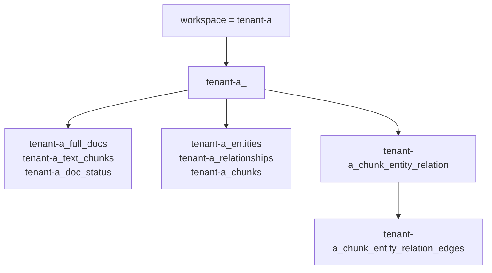
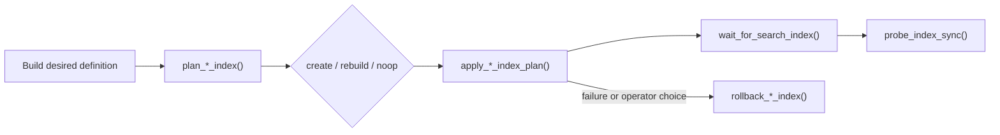

# Storage

HybridRAG maps its key-value records, document status, knowledge graph, vectors, and text search to MongoDB collections. `src/hybridrag/engine/kg/mongo_impl.py` implements the storage contracts from `src/hybridrag/engine/base.py`; `src/hybridrag/engine/kg/shared_storage.py` coordinates initialization and locks across coroutines and worker processes.

## Purpose

The MongoDB backend gives each engine storage role a focused adapter:

| Implementation | Stored data |
| --- | --- |
| `MongoKVStorage` | Full documents, chunks, LLM cache entries, and entity/relationship tracking records |
| `MongoDocStatusStorage` | Processing status, timestamps, file paths, track IDs, errors, and metadata |
| `MongoGraphStorage` | Entity nodes and relationship edges |
| `MongoVectorDBStorage` | Entity, relationship, and chunk vectors plus searchable fields |

All four classes are defined in `src/hybridrag/engine/kg/mongo_impl.py`. `ClientManager` shares one `AsyncMongoClient` database handle and uses reference counting to close it after the last storage finalizes.

## Collection layout and naming

Stable logical names come from `NameSpace` in `src/hybridrag/engine/namespace.py`:

```text
full_docs
text_chunks
llm_response_cache
full_entities
full_relations
entity_chunks
relation_chunks
entities
relationships
chunks
chunk_entity_relation
doc_status
```

`resolve_workspace()` in `src/hybridrag/engine/kg/mongo_impl.py` prefers an explicitly supplied workspace, including an explicit empty string. It consults `MONGODB_WORKSPACE` only when the caller supplies `None`. Storage constructors name a collection `<workspace>_<namespace>` when the resolved workspace is non-empty and use `<namespace>` otherwise.

The graph adapter adds a second collection named `<workspace>_chunk_entity_relation_edges`. Vector index names are also workspace-aware: workspaced collections use `vector_knn_index_<collection>`, while unscoped collections retain `vector_knn_index` for backward compatibility. Chunk text indexes use `text_search_index_<collection-or-namespace>`.



Workspace prefixes isolate physical collections. They are separate from the row-level mandatory filters described in [Security](security.md).

## Data access behavior

### Key-value and status records

`MongoKVStorage.upsert()` performs unordered logical upserts as `UpdateOne` operations keyed by `_id`. It maintains `create_time` on insert and refreshes `update_time` on every write. Text chunks also receive an `llm_cache_list` when absent.

`MongoDocStatusStorage` converts old records into the current `DocProcessingStatus` shape. It removes the deprecated `content` field, migrates legacy `error` to `error_msg`, and supplies defaults for missing metadata and file paths. Pagination clamps page size to 10–200 and supports status, creation time, update time, ID, and file-path sorting.

### Graph records

`MongoGraphStorage` stores nodes and edges separately. Node IDs are entity names. Edge documents contain source and target node IDs, relation properties, source chunk IDs, file paths, and timestamps. Traversal uses MongoDB `$graphLookup`; label search tries Atlas Search methods and falls back to a regular-expression query when Search is unavailable.

### Vector records

`MongoVectorDBStorage` supports client-generated vectors for all vector collections. The chunks collection can instead use MongoDB Automated Embedding, configured through `vector_embedding_backend` and `automated_embedding_model`. Its query methods expose vector, filtered, and hybrid retrieval, including `$rankFusion` or `$scoreFusion`, exact or approximate vector execution, and optional native reranking.

See [Engine](engine.md) for how these stores participate in a query and [Embeddings](embeddings.md) for client-side vector generation.

## Shared state and locking

`initialize_share_data()` in `src/hybridrag/engine/kg/shared_storage.py` chooses local dictionaries and `asyncio.Lock` objects for one worker, or `multiprocessing.Manager` proxies and process locks for multiple workers. The module maintains:

- workspace-qualified shared namespaces such as `<workspace>:pipeline_status`;
- one initialization lock for storage setup;
- keyed locks for entity- and relation-level atomic updates;
- per-worker update flags;
- pipeline status shared by ingestion workers.

`KeyedUnifiedLock` sorts requested keys before acquisition to prevent inconsistent lock ordering. In multiprocess mode, each acquisition combines a local async gate with the shared process lock so waiting does not block the event loop. `NamespaceLock` stores its active context in a `ContextVar`, allowing the same wrapper to be reused safely by concurrent coroutines.

## Index lifecycle

MongoDB B-tree indexes and Atlas Search indexes have different lifecycles.

### Operational indexes

Initialization creates ordinary indexes where they are required immediately:

- `MongoDocStatusStorage.create_and_migrate_indexes_if_not_exists()` manages status/time, track ID, and Chinese-collated file-path indexes. Workspace-qualified names replace applicable legacy names.
- `MongoGraphStorage._create_edge_indexes_if_not_exists()` creates source, target, source-target, and descending weight indexes for graph traversal.

### Search and vector indexes

Search-index changes use an inspectable workflow:



`MongoVectorDBStorage.build_vector_index_definition()` validates dimensions, similarity, quantization, flat/HNSW indexing, HNSW options, embedding backend, and filterable metadata fields without changing MongoDB. `build_text_search_index_definition()` maps chunk content and configured metadata fields for Atlas Search. Equivalent methods on `MongoGraphStorage` define the entity-label Search index.

The `plan_*` methods compare the desired definition with the server's current definition and return `create`, `rebuild`, or `noop`. Apply methods retain the previous definition in their result so rollback can drop a newly created index or restore an updated one. `list_search_index_statuses()` preserves readiness, queryability, failure details, staged index metadata, and whether the observed definition is fresh.

Search indexes build asynchronously. `wait_for_search_index()` waits for structural readiness, while `probe_index_sync()` runs minimal vector and text queries against the chunks collection to verify newly written documents are actually searchable. The public wrappers in `src/hybridrag/core/rag.py` can plan, apply, roll back, list, wait for, and probe all engine indexes.

## Practical example

```python
plans = await rag.plan_search_indexes()
changed = [plan for plan in plans if plan["action"] != "noop"]

applied = await rag.apply_search_index_plans()
await rag.wait_for_search_indexes(applied)
sync = await rag.verify_index_sync()
```

Apply operations mutate database index definitions. Save the returned plans if an operator may need `rollback_search_index_plans()`.

## Entry points for modification

Add or change MongoDB data operations in the matching class in `src/hybridrag/engine/kg/mongo_impl.py`. Change stable logical collection roles in `src/hybridrag/engine/namespace.py`, but treat existing values as persistent schema names. For synchronization changes, start in `src/hybridrag/engine/kg/shared_storage.py` and account for both single- and multi-process modes.

## Key source files

| File | Purpose |
| --- | --- |
| `src/hybridrag/engine/kg/mongo_impl.py` | MongoDB adapters, collection naming, queries, and index lifecycle |
| `src/hybridrag/engine/kg/shared_storage.py` | Process-aware shared state, namespace locks, keyed locks, and pipeline status |
| `src/hybridrag/engine/base.py` | Abstract storage contracts and document status types |
| `src/hybridrag/engine/namespace.py` | Stable logical namespace constants |
| `src/hybridrag/engine/kg/__init__.py` | Storage registry and environment requirements |
| `src/hybridrag/core/rag.py` | Public multi-index planning, apply, rollback, wait, and probe operations |
